# Arrays

## 217. Contains duplicate

Given an integer array `nums`, return `true` if any value appears **at least twice** in the array, and return `false` if every element is distinct.

**Example:**

- **Input:** `nums = [1,2,3,1]`

- **Output:** `True`


### Approach 1: Compare with set length

If there are duplicates, the length of the set will be smaller than the length of the list.

Creating a set has a time complexity of O(n), because the set uses a hash table. 


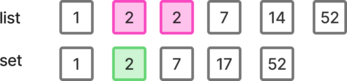


```python
class Solution:
    def containsDuplicate(self, nums: list[int]) -> bool:
        return len(nums) != len(set(nums))
```

Time: O(n) ; Space: O(n)


### Approach 2: Check duplicates while building set

Add each element to a new set. If one element is already in the set, then there is a duplicate.

Adding an element to a set is O(1), and checking its presence is also O(1).


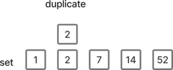


```python
class Solution:
    def containsDuplicate(self, nums: list[int]) -> bool:
        vals = set()
        for num in nums:
            if num in vals:
                return True
            else:
                vals.add(num)
        return False
```

Time: O(n) - Space O(n)


### Approach 3: Sort the list and check for consecutive equal numbers

Once the list is sorted, any equal numbers will be next to each other.

Iterate on the list to check for equal consecutive values.


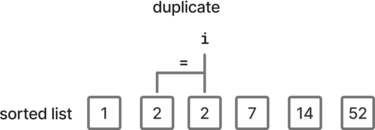


Sorting algorithm:

- Time: O(n log(n))
- Space: O(n)

```python
class Solution:
    def containsDuplicate(self, nums: list[int]) -> bool:
        nums.sort()
        for i in range(1, len(nums)):
            if nums[i] == nums[i - 1]:
                return True
        return False
```

Time: O(n log(n)) - Space O(n)


## 268. Missing number

Given an array `nums` containing `n` distinct numbers in the range `[0, n]`, return *the only number in the range that is missing from the array.*

 **Example:**

- **Input:** `nums = [3,0,1]`

- **Output:** `2`


### Approach 1: Difference between expected and actual sum

The max value of the list `n` is equal to the length of the provided list, because one number is missing.

Therefore, all expected numbers can be expressed using `range(len(nums)+1)`

The difference between the expected sum (0, 1, ... n) and the actual sum is the missing number.


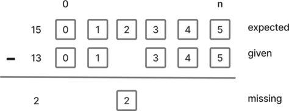


```python
class Solution:
    def missingNumber(self, nums: list[int]) -> int:
        return sum(range(len(nums) + 1)) - sum(nums)
```

Time: O(n) - Space: O(n)


### Approach 2: Sort the given numbers and find the discrepancy

Once the given numbers are sorted, iterate on the `n` first expected values and if there is a mismatch, return the expected value.

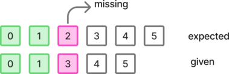


If there was no mismatch, then the missing value is the last one, and return `n`.


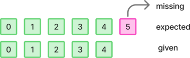


```python
class Solution:
    def missingNumber(self, nums: list[int]) -> int:
        n = len(nums)
        nums.sort()
        for i in range(n):
            if nums[i] != i:
                return i
        return n
```

Time: O(n log(n)) - Space: O(n)


## 448. Find all numbers disappeared in an array

Given an array `nums` of `n` integers where `nums[i]` is in the range `[1, n]`, return *an array of all the integers in the range* `[1, n]` *that do not appear in* `nums`.

**Example:**

- Input: `nums = [4,3,2,7,8,2,3,1]`
- Output: `[5,6]`


### Approach 1: Difference between expected and given sets

Create the set of the numbers and the expected set.
Return the difference of the sets as a list.

```python
class Solution:
    def findDisappearedNumbers(self, nums: list[int]) -> list[int]:
        s_nums = set(nums)
        s_exp = set(range(1, len(nums) + 1))
        return list(s_exp - s_nums)
```

Time: O(n) - Space: O(n)


### Approach 2: Find expected values not present in the given set

Create the set of the given numbers.
While iterating on the expected numbers, add to the result the ones not present in the set.
Slightly better in term of memory, but still O(n).

```python
class Solution:
    def findDisappearedNumbers(self, nums: list[int]) -> list[int]:
        s_nums = set(nums)

        res = []
        for num in range(1, len(nums) + 1):
            if num not in s_nums:
                res.append(num)
        return res
```

Time: O(n) - Space: O(n)


### Approach 3: Use the sign and the index to represent whether a given number is present

Keep the record of which number exists by reusing the `nums` array.
Since all numbers are strictly positive, we can change the sign of the number to mark its presence at a given index, which is O(n).

- index `i` represents number `i + 1`


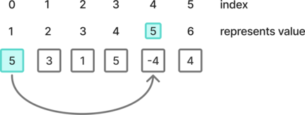


Then, return the corresponding numbers at the index which still have a positive sign.


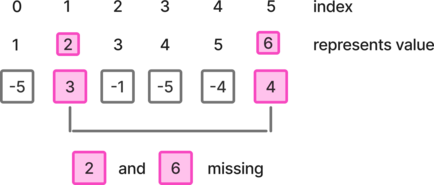


```python
class Solution:
    def findDisappearedNumbers(self, nums: list[int]) -> list[int]:
        for n in nums:
            i = abs(n) - 1
            if nums[i] > 0:
                nums[i] *= -1

        res = []
        for i in range(len(nums)):
            if nums[i] > 0:
                res.append(i + 1)

        return res
```

Time O(n)

Space O(1) - *excepted the returned list*


### Approach 4: DP

Use extra memory to save whether a number was found based on its index.

Mark all found numbers, then add all the missing numbers to the result.

```python
class Solution:
    def findDisappearedNumbers(self, nums: list[int]) -> list[int]:
        buf = [False] * len(nums)

        for i in nums:
            buf[i - 1] = True

        res = []
        for i in range(len(buf)):
            if buf[i] is False:
                res.append(i + 1)
        return res
```

 Time: O(n) - Space: O(n)


## 1. Two sum

Given an array of integers `nums` and an integer `target`, return *indices of the two numbers such that they add up to `target`*.

You may assume that each input would have ***exactly\* one solution**, and you may not use the *same* element twice.

You can return the answer in any order.


**Example:**

- Input:`nums = [2,7,11,15]`, `target = 9`
- Output: `[0,1]`


### Approach 1: Dynamic index dictionary

We want to iterate over the list, and if for a number `num`, `target - num` is also present in the list, we want to return the index of `num`, as well as the index of `target - num`.

However, we want to ensure that `num` and `target - num` are two different numbers, because we can't count a number twice.

The solution for this to build dynamically a dictionary of the already added numbers and their corresponding index, since the number found in the dictionary will be different from the current number.

Using a dictionary also enables to look up the values with O(1) time complexity.


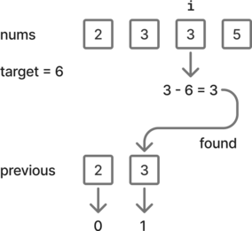


```python
class Solution:
    def twoSum(self, nums: list[int], target: int) -> list[int]:
        map = {}
        for i, num in enumerate(nums):
            if target - num in map:
                return [map[target - num], i]
            map[num] = i
```

Time: O(n) - Space: O(n)


### Approach 2: Reversed list index dictionary

Similar to the previous approach. Compute the full number to index dictionary for the reversed list - from right to left. This will ensure that if there are duplicate values, the index of the leftest most value will be recorded.

Then iterate on the list from left to right and if there is a match, ensure that we have two different numbers by checking that the index of the matching number is different than one of the current number.

```python
class Solution:
    def twoSum(self, nums: list[int], target: int) -> list[int]:
        n = len(nums)
        d_nums = {num: n - i - 1 for i, num in enumerate(reversed(nums))}
        for i, num in enumerate(nums):
            num2 = target - num
            if num2 in d_nums and i != d_nums[num2]:
                return [i, d_nums[num2]]
```

Time: O(n) - Space: O(n)


### Approach 3: Use two pointers on the sorted list

Since we want to return the original indexes, we need to keep track of them. One solution is to store them with the numbers withing a tuple. Then we can sort the array by number.

Place the pointers at each end, then depending on whether the sum of the values they are pointing to is larger or smaller than the target, move the corresponding pointer to get closer to the target.

If the sum is matching, return the original indexes.

```python
class Solution:
    def twoSum(self, nums: list[int], target: int) -> list[int]:
        buf = [(i, val) for i, val in enumerate(nums)]
        buf.sort(key=lambda x: x[1])
        left, right = 0, len(nums) - 1
        while True:
            val = buf[left][1] + buf[right][1]
            if val == target:
                return [buf[left][0], buf[right][0]]
            elif val < target:
                left += 1
            else:
                right -= 1
```

Time: O(n log(n)) - Space: O(n)


## 1365. How many numbers are smaller than the current number

Given the array `nums`, for each `nums[i]` find out how many numbers in the array are smaller than it. That is, for each `nums[i]` you have to count the number of valid `j's` such that `j != i` **and** `nums[j] < nums[i]`.

Return the answer in an array.


**Example:**

- Input: `nums = [8,1,2,2,3]`
- Output: `[4,0,1,1,3]`


### Approach 1: Use sorted list indexes

By sorting the list in the ascending order, the index of the first occurrence of each number corresponds to the number of smaller numbers.


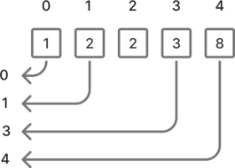


We save these values in a dictionary. To ensure that we keep the index of the first occurrence of a number, we should add it only if it is not already present.

Then build the result list using the values from the dictionary.

```python
class Solution:
    def smallerNumbersThanCurrent(self, nums: list[int]) -> list[int]:
        s_nums = sorted(nums)

        d_val = {}
        for i, num in enumerate(s_nums):
            if num not in d_val:
                d_val[num] = i

            return [d_val[num] for num in nums]
```

Time: O(n log(n)) - Space: O(n)


### Approach 2: DP and previous number cumulative count

Since the numbers are relatively small (not higher than 100), we can use DP to count the occurrences of each number without having to sort the list.

Because the occurrence of a number only matters for numbers higher than the current number, we save the occurrence of the number `i` at index `i + 1`.

Then we compute the cumulative sum of the previous number count. Finally we can retrieve the values for the given numbers to build the result list.


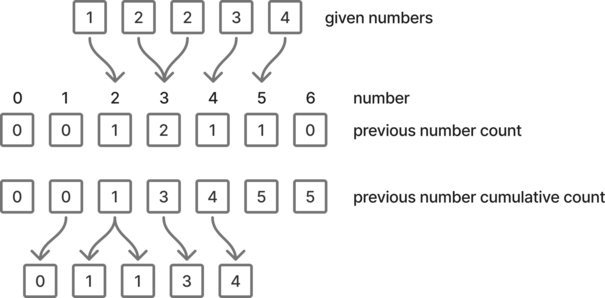


Since we don't need to sort the numbers, the time complexity can be reduced from O(n log(n)) to O(n).


```python
class Solution:
    def smallerNumbersThanCurrent(self, nums: list[int]) -> list[int]:
        dp = [0] * 102
        for num in nums:
            dp[num + 1] += 1

        for val in range(1, 102):
            dp[val] += dp[val - 1]

        return [dp[val] for val in nums]
```

Time: O(n) - Space: O(n)
