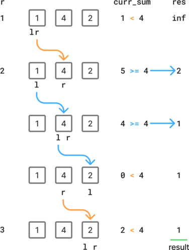

# Array, sliding window

## 219. Contains Duplicate II

Given an integer array `nums` and an integer `k`, return `true` *if there are two **distinct indices*** `i` *and* `j` *in the array such that* `nums[i] == nums[j]` *and* `abs(i - j) <= k`.


**Example:**

- Input: `nums = [4,1,2,3,1]`, `k = 3`
- Output: `True`


### Approach 1: Create window set, then slide it over the array.

If `k` is zero, it's impossible to produce a result with different indices, therefore we can safely return `False`.

If `k` is larger than the array length, we reduce it to the array length to avoid overflows.

First we compute the set of the initial window. We can detect duplicates in the initial window by comparing the set length with the window size.

Then we iterate on the remaining values.

- If the next value is in the set, we found a duplicate.
- Otherwise update the window set by removing the oldest value and adding the current value.


````python
class Solution:
    def containsNearbyDuplicate(self, nums: list[int], k: int) -> bool:
        if k == 0:
            return False
        if k > len(nums):
            k = len(nums)

        window_set = set(nums[:k])
        if len(window_set) != k:
            return True

        for i in range(k, len(nums)):
            if nums[i] in window_set:
                return True
            window_set.remove(nums[i - k])
            window_set.add(nums[i])

        return False
````

Time: O(n) - Space: O(n)


### Approach 2: Build sliding window set progressively

Similar to the previous approach, but start with an empty window set and build it progressively until it reaches its maximum size.

This approach allows checking whether we have a duplicate at a single place, since we don't have to check whether the initial window contains a duplicate.

Also, we don't have to test whether `k` is larger than the array length.

If `k` is zero, each element added to the set will be immediately removed, leaving the set always empty and ensuring that the result will be `False`. 

While the time complexity of this algorithm remains O(n), it is slightly less efficient, because:

- There are more operations to compute the first window.
- If `k` is zero, it will iterate through all the list, which is unnecessary.


```python
class Solution:
    def containsNearbyDuplicate(self, nums: list[int], k: int) -> bool:
        seen = set()
        for i, num in enumerate(nums):
            if num in seen:
                return True
            seen.add(num)
            if len(seen) > k:
                seen.remove(nums[i - k])
        return False
```

Time: O(n) - Space: O(n)


## 1200. Minimum absolute difference

### Approach 1: Find minimum difference in sorted array, then find corresponding pairs

Sort the array in ascending order.

The minimum difference `min_diff` can be found by checking each pair of consecutive values.

Then we can find each pairs of consecutive values which difference is `min_diff`.


```python
class Solution:
    def minimumAbsDifference(self, arr: list[int]) -> list[list[int]]:
        arr.sort()
        
        min_diff = float("inf")
        for i in range(1, len(arr)):
            min_diff = min(min_diff, arr[i] - arr[i - 1])

        res = []
        for i in range(1, len(arr)):
            if arr[i] - arr[i - 1] == min_diff:
                res.append([arr[i - 1], arr[i]])

        return res
```

Time: O(n log(n)) - Space: O(n)

 

## 209. Minimum size sub-array sum

Given an array of positive integers `nums` and a positive integer `target`, return *the **minimal length** of a* sub-array *whose sum is greater than or equal to* `target`. If there is no such sub-array, return `0` instead.

 

**Example:**

- Input: `target = 7`, `nums = [2,3,1,2,4,3]`
- Output: `2`


### Approach 1: Variable sized sliding window with while loop

Use two pointers for the left and right side of the interval.

If the current sum is larger than the target, update the result, move the left pointer and update the current sum.

- If the current number is ` >= target`, `res == 1` and we can use the fact that `l > r` to break the loop and return the result.

Else, move the right pointer and update the sum.

- If `r` is too big, we should not update the sum to avoid an overflow.

```python
class Solution:
    def minSubArrayLen(self, target: int, nums: list[int]) -> int:
        res = float("inf")

        curr_sum = nums[0]
        l, r = 0, 0

        while l <= r < len(nums):
            if curr_sum >= target:
                res = min(res, r - l + 1)
                curr_sum -= nums[l]
                l += 1
            else:
                r += 1
                if r < len(nums):
                    curr_sum += nums[r]

        return 0 if res == float("inf") else res
```

Time: O(n) - Space: O(1)


### Approach 2: Variable sized sliding window with for loop

The sum is updated at the beginning of each iteration, therefore there is no risk of a pointer overflow.

If a value of the array is higher or equal than the target, `curr_sum` will be 0 at the beginning of the next `r` iteration, where `l == r` and both point to the next value.





````python
class Solution:
    def minSubArrayLen(self, target: int, nums: list[int]) -> int:
        res = float("inf")
        curr_sum = 0
        l = 0

        for r in range(len(nums)):
            curr_sum += nums[r]

            while curr_sum >= target:
                res = min(res, r - l + 1)
                curr_sum -= nums[l]
                l += 1

        return 0 if res == float("inf") else res
````

Time: O(n) - Space: O(1)
