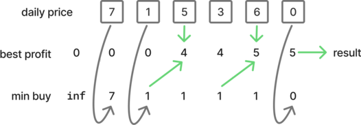
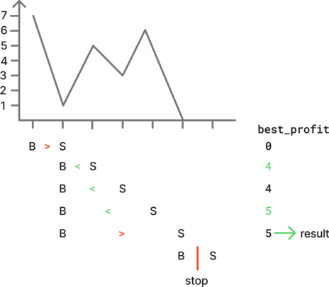
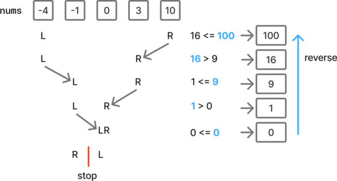

# Array, two pointers

## 121 Best time to buy and sell stock

You are given an array `prices` where `prices[i]` is the price of a given stock on the `ith` day.

You want to maximize your profit by choosing a **single day** to buy one stock and choosing a **different day in the future** to sell that stock.

Return *the maximum profit you can achieve from this transaction*. If you cannot achieve any profit, return `0`.


**Example:**

- Input: `prices = [7,1,5,3,6,4]`
- Output: `5`


### Approach 1: Iterate on list and track key values

While iterating on the list, keep the value of the `min_buy` and `best_profit` so far.

- Update the `best_profit` if the current profit `val - min_buy` is better.
- Then update the `min_buy` if the current value is lower.


When we go through the first value, there is no previous value, and therefore we only want to update `min_buy`, but not `best_profit`. This can be achieved by setting the initial `min_buy` value to infinity.





```python
class Solution:
    def maxProfit(self, prices: list[int]) -> int:
        min_buy = float("inf")
        best_profit = 0

        for val in prices:
            if val - min_buy > best_profit:
                best_profit = val - min_buy
            if val < min_buy:
                min_buy = val

        return best_profit
```

Time: O(n) - Space: O(1)


### Approach 2: Use two pointers moving to the right

Initialize the two pointers `buy_i`, `sell_i` in the first two positions.

Iterate on the daily prices:

- If the sell sell value is higher than the buy value, update `best_profit` if better.

- Otherwise, we found a lower point and we should restart from that point.
- Finally, increment `sell_i` to evaluate the next value in the next iteration.





```python
class Solution:
    def maxProfit(self, prices: list[int]) -> int:
        buy_i, sell_i = 0, 1
        best_profit = 0

        while sell_i != len(prices):
            if prices[buy_i] < prices[sell_i]:
                profit = prices[sell_i] - prices[buy_i]
                if profit > best_profit:
                    best_profit = profit
            else:
                buy_i = sell_i
            sell_i += 1

        return best_profit
```

Time: O(n) - Space: O(1)


## 977. Squares of a sorted array

Given an integer array `nums` sorted in **non-decreasing** order, return *an array of **the squares of each number** sorted in non-decreasing order*.


**Example:**

- Input: `nums = [-4,-1,0,3,10]`
- Output: `[0,1,9,16,100]`


### Approach 1: Compute the squares and sort the array

This solution is trivial, but not the most efficient.

```python
class Solution:
    def sortedSquares(self, nums: list[int]) -> list[int]:
        for i in range(len(nums)):
            nums[i] *= nums[i]
        nums.sort()
        return nums
```

Time: O(n log(n)) - Space: O(n)


### Approach 2: Use two pointers moving from both ends

Initially, the pointers are each at one end of the list.

The cell which square has the greatest value is selected:

- the corresponding pointer moves towards the center.
- the square value of the cell is added to the result.

Since the result list is built with the values in descending order, it has to be reversed before returning it.

/!\: When the left and right pointers overlap, the last cell is added. After that both pointers will cross, which ends the loop.

/!\: If both pointers point to the same value, it doesn't matter which one we select.





```python
class Solution:
    def sortedSquares(self, nums: list[int]) -> list[int]:
        l, r = 0, len(nums) - 1
        res = []

        while l <= r:
            if nums[l] ** 2 > nums[r] ** 2:
                res.append(nums[l] ** 2)
                l += 1
            else:
                res.append(nums[r] ** 2)
                r -= 1

        res.reverse()
        return res
```

Time: O(n) - Space: O(1)
