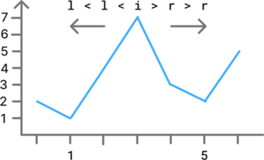

# Array, two pointers

## 121. Best time to buy and sell stock

You are given an array `prices` where `prices[i]` is the price of a given stock on the `ith` day.

You want to maximize your profit by choosing a **single day** to buy one stock and choosing a **different day in the future** to sell that stock.

Return *the maximum profit you can achieve from this transaction*. If you cannot achieve any profit, return `0`.


**Example:**

- Input: `prices = [7,1,5,3,6,4]`
- Output: `5`


### Approach 1: Iterate on list and track key values

While iterating on the list, keep the value of the `min_buy` and `best_profit` so far.

- Update the `best_profit` if the current profit `val - min_buy` is better.
- Then update the `min_buy` if the current value is lower.


When we go through the first value, there is no previous value, and therefore we only want to update `min_buy`, but not `best_profit`. This can be achieved by setting the initial `min_buy` value to infinity.


```python
class Solution:
    def maxProfit(self, prices: list[int]) -> int:
        min_buy = float("inf")
        best_profit = 0

        for val in prices:
            if val - min_buy > best_profit:
                best_profit = val - min_buy
            if val < min_buy:
                min_buy = val

        return best_profit
```

Time: O(n) - Space: O(1)


### Approach 2: Use two pointers moving to the right

Initialize the two pointers `buy_i`, `sell_i` in the first two positions.

Iterate on the daily prices:

- If the sell sell value is higher than the buy value, update `best_profit` if better.

- Otherwise, we found a lower point and we should restart from that point.
- Finally, increment `sell_i` to evaluate the next value in the next iteration.


```python
class Solution:
    def maxProfit(self, prices: list[int]) -> int:
        buy_i, sell_i = 0, 1
        best_profit = 0

        while sell_i != len(prices):
            if prices[buy_i] < prices[sell_i]:
                profit = prices[sell_i] - prices[buy_i]
                if profit > best_profit:
                    best_profit = profit
            else:
                buy_i = sell_i
            sell_i += 1

        return best_profit
```

Time: O(n) - Space: O(1)


## 977. Squares of a sorted array

Given an integer array `nums` sorted in **non-decreasing** order, return *an array of **the squares of each number** sorted in non-decreasing order*.


**Example:**

- Input: `nums = [-4,-1,0,3,10]`
- Output: `[0,1,9,16,100]`


### Approach 1: Compute the squares and sort the array

This solution is trivial, but not the most efficient.

```python
class Solution:
    def sortedSquares(self, nums: list[int]) -> list[int]:
        for i in range(len(nums)):
            nums[i] *= nums[i]
        nums.sort()
        return nums
```

Time: O(n log(n)) - Space: O(n)


### Approach 2: Use two pointers moving from both ends

Initially, the pointers are each at one end of the list.

The cell which square has the greatest value is selected:

- the corresponding pointer moves towards the center.
- the square value of the cell is added to the result.

Since the result list is built with the values in descending order, it has to be reversed before returning it.

/!\ When the left and right pointers overlap, the last cell is added. After that both pointers will cross, which ends the loop.

/!\ If both pointers point to the same value, it doesn't matter which one we select.


```python
class Solution:
    def sortedSquares(self, nums: list[int]) -> list[int]:
        l, r = 0, len(nums) - 1
        res = []

        while l <= r:
            if nums[l] ** 2 > nums[r] ** 2:
                res.append(nums[l] ** 2)
                l += 1
            else:
                res.append(nums[r] ** 2)
                r -= 1

        res.reverse()
        return res
```

Time: O(n) - Space: O(n)


## 167. Two sum II - Input array is sorted

Given a **1-indexed** array of integers `numbers` that is already **sorted in non-decreasing order**, find two numbers such that they add up to a specific `target` number.

Return *the indices of the two numbers,* `index1` *and* `index2`*, **added by one** as an integer array* `[index1, index2]` *of length 2.*

The tests are generated such that there is **exactly one solution**. You **may not** use the same element twice.

Your solution must use only constant extra space.


**Example:**

- Input: `numbers = [2,7,11,15]`, `target = 9`
- Output: `[1,2]`


### Approach 1: Use two pointers moving from both ends

Initially, the pointers are each at one end of the list.

If the sum of the values of the current cells is:

- greater than the target, move the left pointer to the right to decrease the sum.
- smaller than the target, move the right pointer to the left to increase the sum.
- equal to the target, return the pointers as the result.


```python
    def twoSum(self, nums: list[int], target: int) -> list[int]:
        l, r = 0, len(nums) - 1
        while True:
            curr_sum = nums[l] + nums[r]
            if curr_sum == target:
                return [l + 1, r + 1]
            elif curr_sum < target:
                l += 1
            else:
                r -= 1
```

Time: O(n) - Space: O(1)


## 15. 3 Sum

Given an integer array nums, return all the triplets `[nums[i], nums[j], nums[k]]` such that `i != j`, `i != k`, and `j != k`, and `nums[i] + nums[j] + nums[k] == 0`.

Notice that the solution set must not contain duplicate triplets.


**Example:**

- Input: `nums = [-1,0,1,2,-1,-4]`
- Output: `[[-1,-1,2],[-1,0,1]]`


### Approach 1: Reduce to an iterative 2 Sum II problem

If we select a given cell `i`, we can reduce the problem as a 2 Sum II problem, where we look for the two pointers `l` and `r`, where `nums[l] + nums[r] == target == - nums[i]`. 

Since the Two Sum II time complexity is O(n), the resulting time complexity will be O(n²).

The main difficulty is that we don't want to return duplicate triplets.

- Since the `nums` array is sorted, we can avoid `i` pointing to the same value by checking the previous value.
- When a matching triplet is found, we increase  the `l` pointer it as long as long as it matches the previous value to ensure that the next evaluated triplet will be different.

If `nums[i] > 0`, all values of the triplets will be strictly positive and therefore can't sum up to zero. We can return the result at this point.


```python
class Solution:
    def threeSum(self, nums: list[int]) -> list[list[int]]:
        n = len(nums)
        nums.sort()
        res = []
        for i in range(n - 2):
            if nums[i] > 0:
                return res
            if i and nums[i] == nums[i - 1]:
                continue

            l, r = i + 1, n - 1
            while l < r:
                val = nums[l] + nums[r] + nums[i]
                if val < 0:
                    l += 1
                elif val > 0:
                    r -= 1
                else:
                    res.append([nums[i], nums[l], nums[r]])
                    l += 1
                    while nums[l] == nums[l - 1] and l < r:
                        l += 1

        return res
```

Time: O(n²) - Space: O(n)


## 845. Largest mountain in an array

An array `arr` is a **mountain array** if and only if:

- `arr.length >= 3`
- There exists some index `i`  such that it points to a value strictly higher than both of its adjacent values.

Given an integer array `arr`, return *the length of the longest subarray, which is a mountain*. Return `0` if there is no mountain subarray.


**Example:**

- Input: `arr = [2,1,4,7,3,2,5]`
- Output: `5`


### Approach 1: For each peak, evaluate mountain size with two pointers

Since the peaks need to have an adjacent value on both sides, we iterate on the array while excluding the two extremes.

If `i` points to a peak:

- use two pointers moving independently to find the base of the mountain on each side.
- update the result if we found a larger value.


/!\ To count the length of the mountain correctly, we need to add 1 to the difference between the pointers.





Through the main loop, we iterate on the array once. &rarr; O(n)

When looking for the mountain length, each cell is searched only once, because it can belong to not more than one mountain. &rarr; O(n)

With both time complexities adding up, we stay to O(n).


```python
    def longestMountain(self, arr: list[int]) -> int:
        res = 0
        for i in range(1, len(arr) - 1):
            if arr[i - 1] < arr[i] > arr[i + 1]:
                l, r = i - 1, i + 1
                while l > 0 and arr[l - 1] < arr[l]:
                    l -= 1
                while r < len(arr) - 1 and arr[r] > arr[r + 1]:
                    r += 1
                res = max(res, r - l + 1)
        return res
```

Time: O(n) - Space: O(1)
