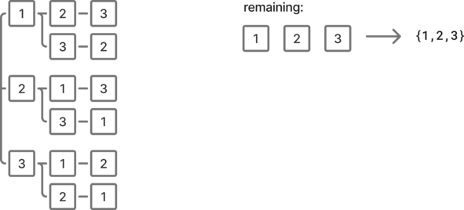
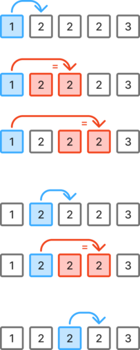

# Backtracking

 ## 46. Permutations

Given an array `nums` of distinct integers, return all the possible permutations. You can return the answer in **any order**.


**Example:**

- Input: `nums = [1,2,3]`
- Output: `[[1,2,3],[1,3,2],[2,1,3],[2,3,1],[3,1,2],[3,2,1]]`

 

### Approach 1: Backtrack permutations using a set

We can represent the remaining possibilities using a set. Then, iterate on the remaining elements of the set while updating the temporary path and recursively explore the remaining possibilities.

When there are no more elements remaining, we can add a copy of the current path to the result.

The space complexity is O(n^2), because we need to keep track of the `remaining` set in each recursive call.





```python
class Solution:
    def permute(self, nums: list[int]) -> list[list[int]]:
        s_nums = set(nums)
        res = []

        def backtrack(remaining: set[int], path: list[int]):
            if not remaining:
                res.append(path.copy())
                return

            for num in remaining.copy():
                path.append(num)
                remaining.remove(num)

                backtrack(remaining, path)

                remaining.add(num)
                path.pop()

        backtrack(s_nums, [])
        return res
```

Time: O(n!)

Space: O(n^2) *- excluding the result*


### Approach 2: Swap values in place

By modifying the number array in place, this solution does not use extra memory.

We start by considering all possibilities in the first position using permutations. Then we recursively compute the permutations for the reduced array.

If the start reached the end of the array, add a copy of the current number array to the result.


```python
class Solution:
    def permute(self, nums: list[int]) -> list[list[int]]:
        def backtrack(start: int):
            if start == len(nums):
                res.append(nums[:])
                return

            for i in range(start, len(nums)):
                nums[start], nums[i] = nums[i], nums[start]
                backtrack(start + 1)
                nums[start], nums[i] = nums[i], nums[start]

        res = []
        backtrack(0)
        return res
```

Time: O(n!)

Space: O(1) *- excluding the result*


### Approach 3: Using a circular buffer

Similar to the previous solution, but uses a circular buffer using `pop(0)` and `append` instead of swapping values and using start indexes.
The number array is temporarily smaller when the recursion call is done.

`pop(0)` with its time complexity of O(n) is not efficient. But it doesn't change much the overall time complexity which is already `n!`.

```python
class Solution:
    def permute(self, nums: list[int]) -> list[list[int]]:
        if len(nums) == 1:
            return [nums[:]]

        res = []

        for _ in range(len(nums)):
            n = nums.pop(0)
            perms = self.permute(nums)

            for p in perms:
                p.append(n)

            res.extend(perms)
            nums.append(n)

        return res
```


## 47. Permutations II

Given a collection of numbers, `nums`, that **might contain duplicates**, return **all possible unique permutations** in any order.


**Example:**

- Input: `nums = [1,1,2]`
- Output: `[[1,1,2], [1,2,1], [2,1,1]]`


### Approach 1: Using a dictionary or Counter object

Since there might be duplicates in the list but need to return unique permutations, we don't want to count picking the same value twice, even if the numbers are at different indexes.

To realize that, we can use a dictionary of occurrences, which counts how many of each number we can still add to the path. Note that instead of a counter object, one could also use a dictionary or a defaultdict.

To detect when we should add the current path to the result, one idea is to check whether all values of the counter are zero. But we can also compare the current path length with the numbers length, which is more efficient.


We can avoid using more memory than necessary by recursively building the path as a stack.


```python
class Solution:
    def permuteUnique(self, nums: list[int]) -> list[list[int]]:
        values = Counter(nums)
        res = []
        path = []

        def backtrack():
            if len(path) == len(nums):
                res.append(path.copy())

            for val in values:
                if values[val]:
                    values[val] -= 1
                    path.append(val)

                    backtrack()

                    path.pop()
                    values[val] += 1

        backtrack()
        return res
```

Time: O(n!)

Space: O(n)  *- excluding the result*


## 39. Combination Sum

Given an array of **distinct** integers `candidates` and a target integer `target`, return *a list of all **unique combinations** of* `candidates` *where the chosen numbers sum to* `target`*.* You may return the combinations in **any order**.

The **same** number may be chosen from `candidates` an **unlimited number of times**. Two combinations are unique if the frequency of at least one of the chosen numbers is different.


**Example:**

- Input: `candidates = [2,3,6,7]`, ` target = 7`
- Output: `[[2,2,3] , [7]]`


### Approach 1: Backtrack while deciding which value to pick

We want to explore all possibilities. Since all numbers are strictly positive, a possibility matters only when its sum is equal or greater than the target.

Instead of keeping track of the current sum, we can decrease the current target value in recursive calls. If we call the backtrack function with `target` equal to zero, it means that the current path sum is equal to the original target.

The first number can be picked among any values. To avoid creating duplicate results, we ensure that every subsequent number picked will be either the same number or any number to the right. This is why we pass the index of the last picked number in the `backtrack` function.

There are at most 2^n paths that we can produce. Therefore the time complexity is O(2^n).

```python
class Solution:
    def combinationSum(self, candidates: list[int], target: int) -> list[list[int]]:
        n = len(candidates)
        res = []

        def backtrack(index: int, path: list[int], target: int):
            if target < 0:
                return

            if target == 0:
                res.append(path.copy())

            for i in range(index, n):
                path.append(candidates[i])
                backtrack(i, path, target - candidates[i])
                path.pop()

        backtrack(0, [], target)
        return res
```

Time: O(2^n)

Space: O(n) *- excluding the result*


### Approach 2: Backtrack while deciding whether to pick a value or not

Similar to the previous approach, but while backtracking, we explore a decision tree representing at each level `i` whether we pick the `i`th value or not.

```python
class Solution:
    def combinationSum(self, candidates: list[int], target: int) -> list[list[int]]:
        res = []

        def backtrack(index: int, path: list[int], total: int):
            if total == target:
                res.append(path.copy())
                return

            if total > target or index >= len(candidates):
                return

            path.append(candidates[index])
            backtrack(index, path, total + candidates[index])
            path.pop()
            backtrack(index + 1, path, total)

            return res

        return backtrack(0, [], 0)
```

Time: O(2^n)

Space: O(n) *- excluding the result*


## 40. Combination Sum II

Given a collection of candidate numbers (`candidates`) and a target number (`target`), find all unique combinations in `candidates` where the candidate numbers sum to `target`.

Each number in `candidates` may only be used **once** in the combination.

**Note:** The solution set must not contain duplicate combinations.

 

**Example:**

- Input: `candidates = [10,1,2,7,6,1,5]` , `target = 8`
- Output: `[[1,1,6],[1,2,5],[1,7],[2,6]]`


### Approach 1: Backtrack while excluding duplicates on sorted list

It is easier to detect duplicates by sorting the candidates list.

To ensure that each cell is used not more than once, it is excluded from subsequent calls by using `i + 1` when backtracking.

It is acceptable to use multiple times the same value from different cells as long as this does not produce duplicate results.

For example in the example below, we want to evaluate to possibility containing all `2` values. But we don't want to jump to the second or third `2` cell if we could have already reached the same state with previous values.


 This is why we skip if we do a jump by more than one and the left value is the same. Because we could have picked the value on the left instead.





```python
class Solution:
    def combinationSum2(self, candidates: list[int], target: int) -> list[list[int]]:
        candidates.sort()
        res = []

        def backtrack(start: int, target: int, path: list[int]):
            if target == 0:
                res.append(path.copy())
                return

            for i in range(start, len(candidates)):
                if i > start and candidates[i] == candidates[i - 1]:
                    continue

                if candidates[i] > target:
                    break

                path.append(candidates[i])
                backtrack(i + 1, target - candidates[i], path)
                path.pop()

        backtrack(0, target, [])
        return res
```

Time: O(2^n)

Space: O(n) *- excluding the result*
