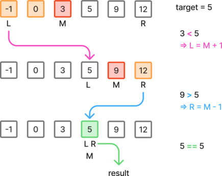
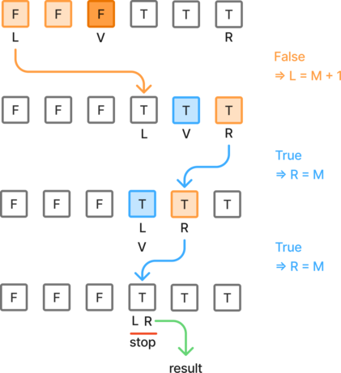
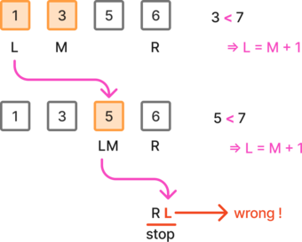

# Binary Search 

## Notes

Binary search is an efficient search algorithm with a time complexity of O(log(n)), making use of the divide and conquer principle.

It works by reducing the search interval by half at each iteration, guaranteeing a fast convergence to the interval of interest.

However, it works only on sorted arrays. Sorting an array would have a time complexity of O(n log(n)).

The main challenges are usually: updating the search interval properly, handling the exit conditions as well as the boundary cases.


## 704. Binary Search

Given an array of integers `nums` which is sorted in ascending order, and an integer `target`, write a function to search `target` in `nums`. If `target` exists, then return its index. Otherwise, return `-1`.

You must write an algorithm with `O(log n)` runtime complexity.

 

**Example:**

- Input: `nums = [-1,0,3,5,9,12]`, `target = 9`
- Output: `4`


### Approach 1: Search exact value, or exclude segment until pointers cross

If the middle pointer `M ` matches the value, we return the index `M`.

Else, we move the left or the right pointer to reduce the search interval.

- Since we know that `M` doesn't point to the value we are looking for, we can exclude it from the next interval: `L = M + 1` or `R = M - 1` .





If the value we are looking for is not present in the array, the `L` and `R` pointers will end up crossing each other. We can use this to detect the absence of the searched value.


```python
class Solution:
    def search(self, nums: list[int], target: int) -> int:
        l, r = 0, len(nums) - 1

        while l <= r:
            mid = (l + r) // 2
            if nums[mid] == target:
                return mid

            if nums[mid] < target:
                l = mid + 1
            else:
                r = mid - 1

        return -1
```

Time: O(log(n)) - Space: O(1)


## 278. First bad version

You are a product manager and currently leading a team to develop a  new product. Unfortunately, the latest version of your product fails the quality check. Since each version is developed based on the previous  version, all the versions after a bad version are also bad.

Suppose you have `n` versions `[1, 2, ..., n]` and you want to find out the first bad one, which causes all the following ones to be bad.

You are given an API `bool isBadVersion(version)` which returns whether `version` is bad. Implement a function to find the first bad version. You should minimize the number of calls to the API.


**Example:**

- Input: `n = 5`,` bad = 4`
- Output: `4`


### Approach 1: Reducing the search interval to a single value

If the middle value `V` is `False`, the version is good and all previous versions including `V` can be excluded from the search interval.

If `V` is `True`, the version is bad and we can exclude all versions on the right of `V`, but not `V` itself, because it might actually be the first occurrence of the bad version we are looking for.

pythonOnce the interval is reduced to a single value, we know that this value will be the first occurrence, at which point we can return the result.





```python
# The isBadVersion API is already defined for you.
# def isBadVersion(version: int) -> bool:

class Solution:
    def firstBadVersion(self, n: int) -> int:
        l, r = 1, n

        while l < r:
            v = (l + r) // 2
            if isBadVersion(v):
                r = v
            else:
                l = v + 1

        return l
```

Time: O(log(n)) - Space: O(1)


## 162. Find peak element

A peak element is an element that is strictly greater than its neighbors.

Given a **0-indexed** integer array `nums`, find a peak element, and return its index. If the array contains multiple peaks, return the index to **any of the peaks**.

You may imagine that `nums[-1] = nums[n] = -∞`. In other words, an element is always considered to be strictly greater than a neighbor that is outside the array.

You must write an algorithm that runs in `O(log n)` time.

Constraint: `nums[i] != nums[i + 1]` for all valid `i`.


**Example:**

- Input: `nums = [1,2,3,1]`
- Output: `2`


### Approach 1: Check if peak, otherwise exclude segment based on neighbors

If the array contains a single element, the peak is that element.

Otherwise can check whether one of the ends might be a peak. This will enable us to assume that each cell we check has a right and a left neighbor while performing the binary search.

Then during the binary search algorithm:

- If the middle value is a peak, return the corresponding index.
- Otherwise, one of the neighbors must be greater than the middle value. Therefore we can exclude the lower side including the middle value: `L = M + 1` or `R = M - 1`.


```python
    def findPeakElement(self, nums: list[int]) -> int:
        if len(nums) == 1:
            return 0

        if nums[0] > nums[1]:
            return 0

        if nums[-1] > nums[-2]:
            return len(nums) - 1

        l, r = 1, len(nums) - 2
        while l <= r:
            mid = (l + r) // 2
            val = nums[mid]
            nex = nums[mid + 1]
            pre = nums[mid - 1]
            if pre < val > nex:
                return mid
            elif nex > val:
                l = mid + 1
            else:
                r = mid - 1
```

Time: O(log(n)) - Space: O(1)


### Approach 2: Reduce the interval to a single value

We can leverage the fact that as long as `L < R`, the middle value `M = (L + R) // 2 ` will always have a neighbor on the right side due to the integer division. Using that value is enough to reduce the search interval.

If the middle value is smaller that its right neighbor, exclude the left segment including M.

If the middle value is larger that its right neighbor, exclude the segment on the right of M, but no M itself.

We can return the result once the interval is reduced to a single cell.


```python
class Solution:
    def findPeakElement(self, nums: list[int]) -> int:
        l, r = 0, len(nums) - 1

        while l < r:
            mid = (l + r) // 2
            if nums[mid] < nums[mid + 1]:
                l = mid + 1
            else:
                r = mid
        return l
```

Time: O(log(n)) - Space: O(1)


## 35. Search insert position

Given a sorted array of distinct integers and a target value, return  the index if the target is found. If not, return the index where it  would be if it were inserted in order.

You must write an algorithm with `O(log n)` runtime complexity.


**Example:**

- Input: `nums = [1,3,5,6]`, ` target = 5`
- Output: `2`


### Approach 1: Reduce segment to a single value

We are looking for the index of the target value or the first greater value. If there is no such value, we should return the last position incremented by one.

If the middle value is smaller than the target, the result must be on the right side of M, so we can exclude the left side segment, including M: `L = M + 1`.

If the middle value is greater or equal than the target, the result might be M or lower, so we can exclude everything on the right of M:  `R = M`.

We can return the result once the interval is reduced to a single cell.


/!\: If the target is greater than the last value of the array, the algorithm will end with both L and R pointing to the last cell and return the wrong value. To avoid this, we can detect this particular case and return `R + 1`.




```python
class Solution:
    def searchInsert(self, nums: list[int], target: int) -> int:
        l, r = 0, len(nums) - 1

        if target > nums[r]:
            return r + 1

        while l < r:
            mid = (l + r) // 2
            if nums[mid] < target:
                l = mid + 1
            else:
                r = mid

        return l
```

Time: O(n) - Space: O(1)


### Approach 2: Exclude segments until the pointers cross

This approach is a bit shorter than the previous one, but less intuitive.

If the middle value is greater or equal than the target, instead of doing `R = M`,  we decide to do `R = M - 1`, which means that the result will be within `[L, R+1]`. 

We perform this because:

- either `M == L` (M is the lowest possible value), which means R will cross over L and L will be result.
- or `M > L` (there is still a search interval on the left of M).
  - if a result is found within the interval, it will be returned
  - otherwise L will end up crossing R: `L = R + 1` and L will also be the result.


If we end by crossing `R` over `L`, the result will be `L`.


If we couldn't find the value within the reduced interval, L will end up crossing over R, which we can return as the result.


If the target is larger than the last value, L will also cross over R and we can return it as the result.


```python
class Solution:
    def searchInsert(self, nums: list[int], target: int) -> int:
        l, r = 0, len(nums) - 1

        while l <= r:
            mid = (l + r) // 2
            if nums[mid] < target:
                l = mid + 1
            else:
                r = mid - 1

        return l
```

Time: O(n) - Space: O(1)
