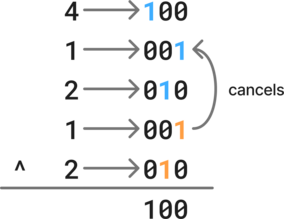

# Bit manipulation

## Notes

| Operation Name      | Symbol | Usage  | Explanation                                       |
| ------------------- | ------ | ------ | ------------------------------------------------- |
| Bitwise And         | &      | a & b  | Return 1 only if both of the bits are 1           |
| Bitwise Or          | \|     | a \| b | Return 1 if one of the bits is 1                  |
| Bitwise Not         | ~      | ~a     | Returns the complement of a bit                   |
| Bitwise Xor         | ^      | a ^ b  | Returns zero if both of the bits are same, else 1 |
| Bitwise Left shift  | <<     | a << n | Shifts `a` towards left by `n` digits             |
| Bitwise Right shift | >>     | a >> n | Shifts `a` towards right by `n` digits            |


## 136. Bit manipulation

Given a **non-empty** array of integers `nums`, every element appears *twice* except for one. Find that single one.

You must implement a solution with a linear runtime complexity and use only constant extra space.


**Example:**- 

- **Input:** `nums = [4,1,2,1,2]`

- **Output:** `4`


### Approach 1: Use XOR properties to cancel duplicate values

The properties of the XOR operation guarantees that any number XORed to itself returns zero because the ones will cancel each other.

The same applies to a list of values containing only duplicates.

If a list of values contains only duplicates except one unique value, then the resulting value will be unique one.





/!\ The order of the elements in the list does not matter. To be convinced of this, just consider that the number of flips for a given bit is only depends on the number of ones present.

```python
class Solution:
    def singleNumber(self, nums: list[int]) -> int:
        buf = 0
        for num in nums:
            buf ^= num
        return buf
```

Time: O(n) - Space: O(1)

 

Other approaches:

- Sort the array, iterate on each pair of consecutive value and find the unique one
  - However, the sorting time complexity is O(n log(n)) and space complexity is O(n)
- Using a set to register the added values, add the value to the sum if the value is new, subtract if already added.
  - However, the space complexity of O(n)
