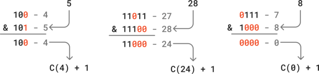

# Dynamic programming

Dynamic programming is usually used for problems which include an explosion of possibilities to consider. DP algorithms usually trade complexity for memory.

The main idea is to cut the problem into smaller or more simple problems, then the results are saved, and then reused to find a solution efficiently.

The results might be saved using:

- an array or a grid
- a mapping
- a bit-mask


## 70. Climbing stairs

You are climbing a staircase. It takes `n` steps to reach the top.

Each time you can either climb `1` or `2` steps. In how many distinct ways can you climb to the top?

 

**Example:**

- Input: `n = 2`
- Output: `2`


### Approach 1: DP with mapping

If there is one step, there is only one way of climbing the stairs.

If there are two steps, we can either do two single steps, or one double. So there are two ways.

If there are three steps, we can start with either:

- a single step, after which the number of combinations will be `V(2)`.
- a double step, after which the number of combinations will be `V(1)`.

Therefore, we can note that `V(3) = V(2) + V(2)`, and generalize that `V(n) = V(n-1) + V(n-2)`


**Note**: We could also have used `V(0) = 1`, `V(1) = 1` and `V(n) = V(n-1) + V(n-2)`.


We should notice that the recursive approach is inefficient by default, because the same value is computed multiple times. For example: `V(4) = V(3) + V(2) = V(2) + V(1) + V(2)`.

This can be fixed by using a mapping and reusing the already computed values.

```python
class Solution:
    def climbStairs(self, n: int, memo={}) -> int:
        if n in memo:
            return memo[n]
        if n <= 2:
            return n
        
        memo[n] = self.climbStairs(n - 1) + self.climbStairs(n - 2)
        return memo[n]
```

Time: O(n)

Space: O(n)


### Approach 2: DP with array

We can also use an array to compute the values iteratively.


```python
class Solution:
    def climbStairs(self, n: int) -> int:
        if n <= 2:
            return n

        buf = [0] * n
        buf[0] = 1
        buf[1] = 2

        for i in range(2, n):
            buf[i] = buf[i - 2] + buf[i - 1]

        return buf[n - 1]
```

Time: O(n) 

Space: O(n)


### Approach 3: Fibonacci sequence

Or we can compute the value with constant space.

It helps to recognize that we are actually using the Fibonacci sequence.

```python
class Solution:
    def climbStairs(self, n: int) -> int:
        a, b = 0, 1
        for _ in range(n + 1):
            a, b = b, a + b
        return a
```

Time: O(n) 

Space: O(1)


## 322. Coin change

You are given an integer array `coins` representing coins of different denominations and an integer `amount` representing a total amount of money.

Return *the fewest number of coins that you need to make up that amount*. If that amount of money cannot be made up by any combination of the coins, return `-1`.

You may assume that you have an infinite number of each kind of coin.


**Example:**

- Input: `coins = [1,2,5]`, `amount = 11`
- Output: `3`


### Approach 1: Report the coin count by cell & coin

Initialize the DP buffer representing the coin count for each value.

- `-1` means not reached yet.
- the starting point is the index `0`  has the value `0`, which means that we can get zero with zero coins.  

While iterating on all values from zero till the target amount:

- If the value can be reached by a given amount of coins, update the cells which correspond to one more coin. But only do so if there is no value yet, or we can write a lower value.

By doing so, we effectively reduce the problem size by one at each step, until we reach the amount cell, which contains the result.

If the amount couldn't be reached, the value of its cell will remain  `-1`.


```python
class Solution:
    def coinChange(self, coins: list[int], amount: int) -> int:
        coin_count = [-1] * (amount + 1)
        coin_count[0] = 0

        for val in range(amount + 1):
            if coin_count[val] == -1:
                continue
            count = coin_count[val]
            for coin in coins:
                if val + coin > amount:
                    continue
                if coin_count[val + coin] == -1 or count + 1 < coin_count[val + coin]:
                    coin_count[val + coin] = count + 1

        return coin_count[-1]
```

Time: O(coin_count * amount) 

Space: O(amount)


### Approach 2: Report the coin count by cell & coin, but backwards

Similar to the previous approach. The differences being that:

- We initialize the DP buffer with `float("inf")`, which will simplify the coin count update.
- We update backwards, checking if the current cell needs to be updated depending on already updated cells.

```python
class Solution:
    def coinChange(self, coins: list[int], amount: int) -> int:
        dp = [float("inf")] * (amount + 1)
        dp[0] = 0

        for val in range(1, amount + 1):
            for coin in coins:
                if val - coin < 0:
                    continue
                dp[val] = min(dp[val], 1 + dp[val - coin])

        return dp[amount] if dp[amount] != float("inf") else -1
```

Time: O(coin_count * amount) 

Space: O(amount)


### Approach 3: Report the coin count by coin & cell

This approach looks similar to the previous one, but we first add one coin on the whole buffer, then the next, ...


```python
class Solution:
    def coinChange(self, coins: list[int], amount: int) -> int:
        dp = [float("inf")] * (amount + 1)
        dp[0] = 0

        for coin in coins:
            for i in range(coin, amount + 1):
                dp[i] = min(dp[i], dp[i - coin] + 1)

        return dp[amount] if dp[amount] != float("inf") else -1
```

Time: O(coin_count * amount) 

Space: O(amount)


### Approach 4: Breath First Search using a boolean array

Using this approach, the buffer only contains a boolean, indicating whether we are able to reach a given value, but no coin count information.

We can update the buffer together with a `coin_count` variable, effectively using BFS to search for newly reached values.

If we reach the amount cell, we can return the number of iterations. If the amount can't be reached, the search will stall and there will be no buffer update, at which point we can end the search.

/!\ The issue with this approach is its time complexity, since we need potentially `amount` iterations, each iteration potentially requires checking all coins for all cells.


```python
class Solution:
    def coinChange(self, coins: list[int], amount: int) -> int:
        dp = [True] + [False] * amount
        count = 0

        def bfs() -> bool:
            updated = False
            for val in range(amount, -1, -1):
                if not dp[val]:
                    continue
                for coin in coins:
                    if val + coin > amount or dp[val + coin]:
                        continue
                    dp[val + coin] = True
                    updated = True
            return updated

        while True:
            if dp[amount]:
                return count

            count += 1

            if not bfs():
                return -1
```

Time: O(coin_count * amount²) 

Space: O(amount)


### Approach 5: Breath First Search using a bit-mask

It works like the previous approach, but we can use a single number to represent all reached values using the bit-mask technique. By doing so, we can manipulate multiple bits in a single operation.

This solution offers an excellent performance:

- it is very fast. If there is a `coin_count` solution, it will find the solution in only `coin_count` iterations. Although, the worst case time complexity is still O(coin_count * amount)
- it uses constant memory.

If there is a way to reach the amount, it has to be done in `amount + 1` iterations. Otherwise we return `-1`.

```python
class Solution:
    def coinChange(self, coins: list[int], amount: int) -> int:
        curr = 1 << amount
        for i in range(amount + 1):
            if curr & 1 == 1:
                return i
            prev = curr
            curr = 1 << amount
            for coin in coins:
                curr |= prev >> coin
        return -1
```

Time: O(coin_count * amount) 

Space: O(1)


## 338. Counting bits

Given an integer `n`, return *an array* `ans` *of length* `n + 1` *such that for each* `i` (`0 <= i <= n`)*,* `ans[i]` *is the **number of*** `1`***'s** in the binary representation of* `i`.


**Example:**

- Input: `n = 5`

- Output: `[0,1,1,2,1,2]`

- Explanation:

  ```
  0 --> 0
  1 --> 1
  2 --> 10
  3 --> 11
  4 --> 100
  5 --> 101
  ```

  

### Approach 1: Count the number of ones for each number

This solution is trivial. However, the time complexity to count the ones depends on the number length, which increases logarithmically.

```python
class Solution:
    def countBits(self, n: int) -> list[int]:
		return [i.bit_count() for i in range(n + 1)]
```

Time: O(n log n)

Space: O(n)


### Approach 2: Deduce the number from a previous one using the last power of two

First of all, we can notice that powers of two contain a single `1`.

We can also see that there are patterns in the values, for example:

- the values of the interval `2->3` are the same as `0->1`, except being added by one because of the bit in the second position.
- the values of the interval `4->7` are the same as `0->3`, except being added by one because of the bit in the third position.

In other words, the number of `1` for any value can be calculated in constant time using previously computed values.

`C(v) = 1 + C(v - last_power_of_two) `

For example with `7`, the last power of two (or most significant bit value) is `2^3 = 4`. Therefore `C(7) = 1 + C(3)`.


```python
class Solution:
    def countBits(self, n: int) -> list[int]:
        dp = [0] * (n + 1)

        msb_val = 1
        for i in range(1, n + 1):
            if i == msb_val * 2:
                msb_val = i
            dp[i] = 1 + dp[i - msb_val]

        return dp
```

Time: O(n)

Space: O(n)


### Approach 3: Deduce the number from a previous one by removing changed bits

The idea here is to compute a "base" number by removing from the current number the bits that changed compared to its predecessor. We can get this by applying a bitwise AND.

The number we get from this operation has the following properties:

- it is always smaller than the current number, because all we do is remove `1`s in its binary representation.
- it contains always one `1` less than the current number. Indeed:
  - either we changed a `0` to a `1`, which means that only one bit changed and therefore the number of `1`s in the current number is one more than in the "base" number.
  - or we changed one or more `1` into a `0`, ad added a new `1` on the left. Here also, the result for the current number is one more than the "base" number.

Therefore, we can apply the following formula: `C(i) = C(i & (i-1)) `. Which is implemented by reusing the already precomputed values to find the result in constant time.





```python
class Solution:
    def countBits(self, n: int) -> list[int]:
        dp = [0] * (n + 1)

        for i in range(1, n + 1):
            dp[i] = 1 + dp[i & (i - 1)]

        return dp
```

Time: O(n)

Space: O(n)


## 64. Minimum path sum

Given a `m x n` `grid` filled with non-negative numbers, find a path from top left to bottom right, which minimizes the sum of all numbers along its path.

**Note:** You can only move either down or right at any point in time.


**Example:**

- Input: `grid = [[1,3,1],[1,5,1],[4,2,1]]`
- Output: `7`


### Approach 1: Compute the top and left sides, then the intermediate values depending on their neighbors

Since we can only move down or right at any point in time, there is only one possible path to reach cells in the top row and left column:

- top row: we can reach any cell in the top row only by moving right from the initial cell. 
- left column: we can reach any cell in the left column by moving down from the initial cell.

Therefore we can compute the path sum for these cells simply by adding the previous value.

Once the top row and left column are filled, the value of any cell can be computed by adding the minimum between its top and left neighbor. This way, we can save the intermediary result of the minimum path without having to recompute it each time we consider walking through a cell.

This can be repeated until the grid is fully computed. By definition, the bottom right cell of the grid contains the minimum path sum to reach it.


```python
class Solution:
    def minPathSum(self, grid: list[list[int]]) -> int:
        m = len(grid)
        n = len(grid[0])

        for i in range(1, m):
            grid[i][0] += grid[i - 1][0]

        for j in range(1, n):
            grid[0][j] += grid[0][j - 1]

        for i in range(1, m):
            for j in range(1, n):
                grid[i][j] += min(grid[i][j - 1], grid[i - 1][j])

        return grid[-1][-1]
```

Time: O(n)

Space: O(1) - *Excluding the given grid*


## 120. Triangle

Given a `triangle` array, return *the minimum path sum from top to bottom*.

For each step, you may move to an adjacent number of the row below. More formally, if you are on index `i` on the current row, you may move to either index `i` or index `i + 1` on the next row.


**Example:**

- Input: `triangle = [[2],[3,4],[6,5,7],[4,1,8,3]]`

- Output: `11`

- Explanation:

  The triangle looks like:

  ```
     2
    3 4
   6 5 7
  4 1 8 3
  ```

  The minimum path sum from top to bottom is 2 + 3 + 5 + 1 = 11 (underlined above).


### Approach 1: Use DP on the given triangle

The idea is to compute the intermediary path sum from the top to the bottom row:

- if the cell has no left neighbor, it can take the path value only from its right predecessor.
- if the cell has no right neighbor, it can take the path value only from its left predecessor.
- otherwise, take the lowest path value from its predecessors. 

The result is the lowest value in the bottom row.


```python
class Solution:
    def minimumTotal(self, triangle: list[list[int]]) -> int:
        for i in range(1, len(triangle)):
            for j in range(i + 1):
                if j == 0:
                    triangle[i][j] += triangle[i - 1][j]
                elif j == i:
                    triangle[i][j] += triangle[i - 1][j - 1]
                else:
                    triangle[i][j] += min(triangle[i - 1][j], triangle[i - 1][j - 1])

        return min(triangle[-1])
```

Time: O(n)

Space: O(n²) *- including the given array*


### Approach 2: Use DP on a single row

In this approach we compute the values on a single array instead of the whole triangle grid, and we compute from bottom to top.

The initial array contains the lower row. Therefore each value on the upper row has two predecessors, which simplifies the logic.

At the end of the computation, the first value of the array represents the top cell which by definition, contains the minimum path sum.


```python
class Solution:
    def minimumTotal(self, triangle: list[list[int]]) -> int:
        n = len(triangle)
        buf = triangle[-1].copy()
        for row_i in range(n - 2, -1, -1):
            for col_i in range(row_i + 1):
                buf[col_i] = min(buf[col_i], buf[col_i + 1]) + triangle[row_i][col_i]

        return buf[0]
```

Time: O(n)

Space: O(n)
