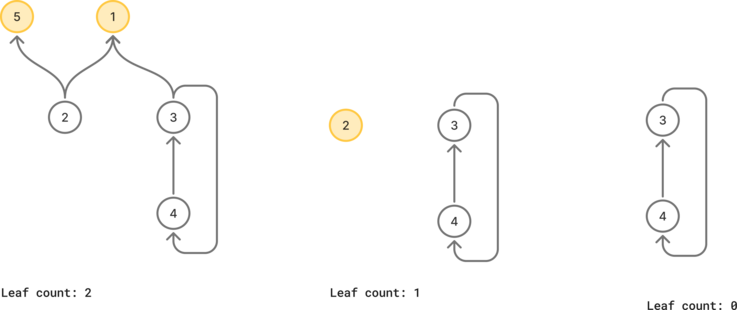
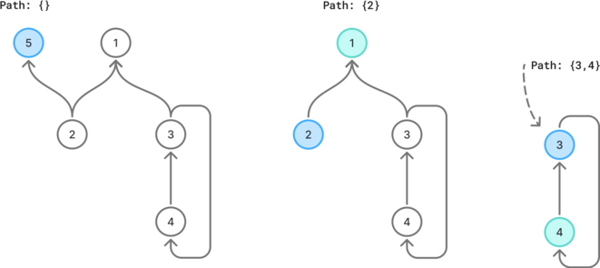
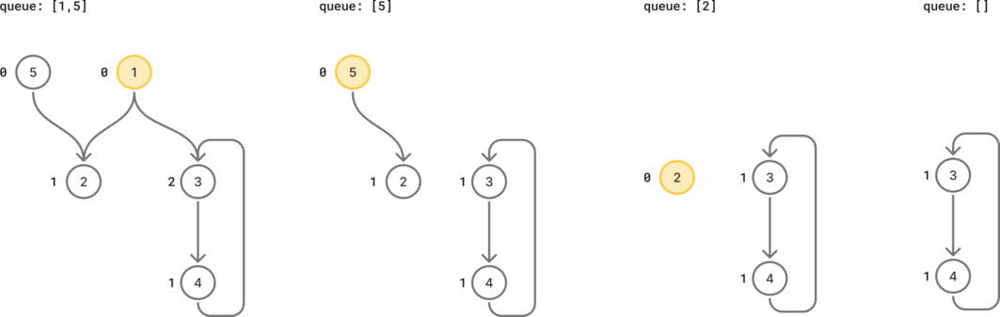

# Graph

## 207. Course schedule

There are a total of `numCourses` courses you have to take, labeled from `0` to `numCourses - 1`. You are given an array prerequisites where `prerequisites[i] = [a_i, b_i]` indicates that you must take course bi first if you want to take course `a_i`.

For example, the pair `[0, 1]`, indicates that to take course 0 you have to first take course 1.

Return true if you can finish all courses. Otherwise, return false.

**Example:**

- Input: `numCourses = 2`, `prerequisites = [[1,0]]`
- Output: `True`


### Approach 1: Cherry picking on top-down directed graph

If there are circular dependencies, it is impossible to deconstruct the graph by removing leaves iteratively, since all remaining nodes will have remaining requirements.

First we build the graph. Then as long as there are nodes in the graph:

- iterate on the graph to create the set of leaves.
- if there are no leaves, we have a circular dependency and return `False`.
- remove all leaves from the graph.
- remove all leaves from the adjacent set of all nodes. This way, all remaining nodes which dependencies are satisfied become new leaves.





```python
class Solution:
    def build_graph(self, prerequisites: list[list[int]]) -> dict[int, set[int]]:
        graph = defaultdict(set)
        for course, prerequisite in prerequisites:
            graph[course].add(prerequisite)
            graph[prerequisite]

        return graph

    def canFinish(self, numCourses: int, prerequisites: list[list[int]]) -> bool:
        graph = self.build_graph(prerequisites)

        while graph:
            leaves = {course for course in graph if not graph[course]}
            if not leaves:
                return False
            for leaf in leaves:
                del graph[leaf]
            for course in graph:
                graph[course] -= leaves

        return True
```

Time: O(edges + vertices^2)

Space: O(edges)


### Approach 2: Using DFS on top-down directed graph

#### Approach

If the directed graph does not contain any cycles, after picking an processing its sub-dependencies,  the nodes can be removed, until there are no more lefts in the graph.

Only if there is a circular dependency this is impossible, but we can detect this if we find a node that is already present in the current tree path.

#### Process

Once the graph is built, pick any node while there are still nodes in the graph and use DFS to reach the leaves.

While using DFS, we keep track of the nodes in the path. If a new node we explore is already in the path, we have a circular dependency. At this point, we end picking new nodes and return the result.

After a node has been processed, we can remove it from the graph so that we avoid reprocessing and its sub-dependencies if we come back to it again later.





```python
class Solution:
    def build_graph(self, prerequisites: list[list[int]]) -> dict[int, list[int]]:
        graph = defaultdict(set)
        for course, prerequisite in prerequisites:
            graph[course].add(prerequisite)
            graph[prerequisite]

        return graph

    def canFinish(self, numCourses: int, prerequisites: list[list[int]]) -> bool:
        graph = self.build_graph(prerequisites)

        path = set()
        circular_dep = False

        def find_deps(course: int):
            nonlocal circular_dep

            if course not in graph:
                return

            if course in path:
                circular_dep = True
                return

            path.add(course)
            for dep in graph[course]:
                find_deps(dep)
            path.remove(course)

            del graph[course]

        while graph and not circular_dep:
            find_deps(next(iter(graph)))

        return not circular_dep
```
Time: O(edges)

Space: O(edges)


### Approach 4: DFS with array on top-down directed graph

Similar to the previous approach, but since each vertex is represented by a unique number between `[0, numCourses]`, we can represent the vertex state using an array.

This is an alternative to delete nodes from the graph to mark them as visited and using a set of the nodes in the current path.

While using DFS:

- if the node is marked as visited, do nothing &rarr; return True.
- if we are already visiting the node, we have a circular dependency &rarr; return False.
- mark the node temporarily as visiting and explore the sub-nodes. if a circular dependency is found in one of the sub-nodes, also return False.
- finally, mark the node as visited so we don't consider it again.


```python
class Solution:
    def canFinish(self, numCourses: int, prerequisites: list[list[int]]) -> bool:
        graph = defaultdict(list)
        for course, prereq in prerequisites:
            graph[course].append(prereq)

        UNVISITED = 0
        VISITING = 1
        VISITED = 2
        states = [UNVISITED] * numCourses

        def dfs(node: int):
            state = states[node]
            if state == VISITED:
                return True
            elif state == VISITING:
                return False

            states[node] = VISITING

            for prereq in graph[node]:
                if not dfs(prereq):
                    return False

            states[node] = VISITED
            return True

        for i in range(numCourses):
            if not dfs(i):
                return False

        return True
```

Time: O(edges)

Space: O(edges)


### Approach 3: BFS on bottom-up directed graph

#### Approach

In contrast to the previous approaches, we build the directed graph bottom-up, which means that each prerequisite node points towards the courses needing it.

By doing so, we loose the explicit information of whether or not a node requires other nodes. We can keep track of that information using the *in-degree* value, which means how many nodes point towards it.

Nodes which don't have any requirements have no nodes pointing to them. They are source nodes.

#### Process

Once the graph is built, we iterate on the graph once to find the first source nodes.

Then, for each source node, we can iterate efficiently on impacted nodes and check whether they became a source node.

- To do that, we can decrement their in-degree value and check if zero.
- If we have a new source node, we can add it to the queue to process later.

If there is a circular dependency, we will reach a state where the queue is empty while we still didn't process all nodes.





```python
class Solution:
    def canFinish(self, numCourses: int, prerequisites: list[list[int]]) -> bool:
        indegree = [0] * numCourses
        adj_list = defaultdict(list)
        for n_crs, prereq in prerequisites:
            indegree[n_crs] += 1
            adj_list[prereq].append(n_crs)

        queue = deque()
        for n_crs in range(numCourses):
            if indegree[n_crs] == 0:
                queue.append(n_crs)

        while queue:
            crs = queue.popleft()
            numCourses -= 1

            for n_crs in adj_list[crs]:
                indegree[n_crs] -= 1
                if indegree[n_crs] == 0:
                    queue.append(n_crs)

        return numCourses == 0
```

Time: O(edges)

Space: O(edges)


## 127. Word ladder

A **transformation sequence** from word `beginWord` to word `endWord` using a dictionary `wordList` is a sequence of words `beginWord -> s_1 -> s_2 -> ... -> s_k` such that:

- Every adjacent pair of words differs by a single letter.
- Every `s_i` for `1 <= i <= k` is in `wordList`. Note that `beginWord` does not need to be in `wordList`.
- `s_k == endWord`

Given two words, `beginWord` and `endWord`, and a dictionary `wordList`, return *the **number of words** in the **shortest transformation sequence** from* `beginWord` *to* `endWord`*, or* `0` *if no such sequence exists.*


**Example:**

- Input:
  - `beginWord = "hit"`
  - `endWord = "cog"`
  - `wordList = ["hot","dot","dog","lot","log","cog"]`
- Output: `5`


### Approach 1: Build the graph of possible transformations, then use BFS while counting the numbers of operations

#### Complexity analysis

Time complexity:

- the graph is built for all pairs of nodes &rarr; nb_words^2
  - for each word, it needs to check all positions &rarr; len_word
- BFS needs to process at most every node &rarr; nb_words
  - each node has at most nb_words adjacent nodes &rarr; nb_words

Space complexity:

- `graph` is built for all pairs of nodes &rarr; nb_words^2
  - each node contains len_words characters &rarr; len_word
- `queue` contains all nodes in the worst case &rarr; nb_words * len_word
- `visited` contains all nodes in the worst case &rarr; nb_words * len_word

```python
class Solution:
    def _build_graph(self, words: list[str]) -> dict[str, list[str]]:
        graph = defaultdict(set)
        w_count = len(words)
        for wi1 in range(w_count):
            for wi2 in range(wi1 + 1, w_count):
                w1, w2 = words[wi1], words[wi2]
                diff = sum(c1 != c2 for c1, c2 in zip(w1, w2))
                if diff == 1:
                    graph[w1].add(w2)
                    graph[w2].add(w1)

        return graph

    def ladderLength(self, begin_word: str, end_word: str, word_list: list[str]) -> int:
        words = word_list + [begin_word]
        graph = self._build_graph(words)

        queue = [begin_word]
        visited = set()
        count = 1

        while queue:
            new_queue = []
            while queue:
                cur_word = queue.pop()
                if cur_word == end_word:
                    return count
                for word in graph[cur_word]:
                    if word not in visited:
                        visited.add(word)
                        new_queue.append(word)
            queue = new_queue
            count += 1

        return 0
```

Time: O(nb_words^2 * len_word)

Space: O(nb_words^2 * len_word)


### Approach 2: Using BFS and find adjacent nodes only for current words

#### Approach

The main take away of this concept is that it is not needed to build the whole graph by checking all pairs of words, which results in an improved time and space complexity.

Indeed, instead of building the graph checking each pair of words,  it is easier for each processed node to find all possible one-letter variations and check whether it is present in the `word_set`.

#### Complexity analysis

Time complexity:

- at worst each word of `world_list` needs to be processed &rarr; nb_words
  - for each processed word, try 26 other letters for each position in the word &rarr; len_word
    - each new possible word has to be built &rarr; len_word

Space complexity:

- `word_set` &rarr; nb_words * len_word
- `queue` contains all nodes in the worst case &rarr; nb_words * len_word
- `visited` contains all nodes in the worst case &rarr; nb_words * len_word

```python
class Solution:
    def ladderLength(self, begin_word: str, end_word: str, word_list: list[str]) -> int:
        word_set = set(word_list)

        queue = deque([(begin_word, 0)])
        visited = set()

        while queue:
            word, steps = queue.popleft()
            if word == end_word:
                return steps + 1

            for i in range(len(word)):
                for letter in string.ascii_lowercase:
                    if letter != word[i]:
                        new_word = word[:i] + letter + word[i + 1 :]
                        if new_word in word_set and new_word not in visited:
                            visited.add(new_word)
                            queue.append((new_word, steps + 1))

        return 0
```

Time: O(nb_words * len_word^2)

Space: O(nb_words * len_word)


### Approach 3: BFS from both sides to minimize the search range

#### Approach

The main idea of this approach is that we are working on a non-directed graph. However, exploring the graph might be much easier from one particular side if contains fewer nodes, because that means less word permutations to find possible next nodes.

This can be achieved by using a `begin_set` and an `end_set`, and to swap them if the `end_set` contains less elements than the `begin_set`, so that we always explore from the most efficient side.

Note that using this approach we don't need a queue, the current nodes are saved in sets.

#### Complexity analysis

Time complexity:

- `begin_set` contains at most nb_words &rarr; nb_words
  - for each processed word, try 26 other letters for each position in the word &rarr; len_word
    - each new possible word has to be built &rarr; len_word

Space complexity:

- `word_set`, `begin_set`, `end_set` and `next_set` contain at most nb_words &rarr; nb_words * len_word

```python
class Solution:
    def ladderLength(self, begin_word: str, end_word: str, word_list: list[str]) -> int:
        word_set = set(word_list)
        if end_word not in word_set:
            return 0

        begin_set, end_set = {begin_word}, {end_word}
        visited = set()
        steps = 1

        while begin_set:
            if len(begin_set) > len(end_set):
                begin_set, end_set = end_set, begin_set

            next_set = set()

            for word in begin_set:
                for i in range(len(word)):
                    for c in string.ascii_lowercase:
                        if c == word[i]:
                            continue

                        new_word = word[:i] + c + word[i + 1 :]

                        if new_word in end_set:
                            return steps + 1

                        if new_word in word_set and new_word not in visited:
                            visited.add(new_word)
                            next_set.add(new_word)

            begin_set = next_set
            steps += 1

        return 0
```

Time: O(nb_words * len_word^2)

Space: O(nb_words * len_word)
