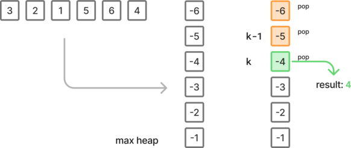
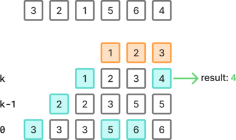
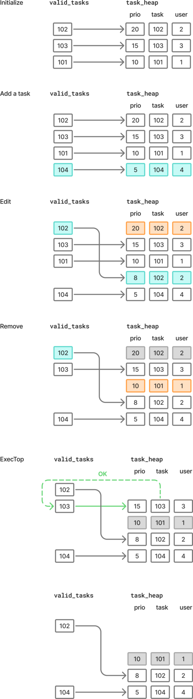

# Heap

## 215. K-th largest element in an array

Given an integer array `nums` and an integer `k`, return *the* `kth` *largest element in the array*.

Note that it is the `kth` largest element in the sorted order, not the `kth` distinct element.

Can you solve it without sorting?


**Example:**

- Input: `nums = [3,2,1,5,6,4]`, `k = 3`
- Output: `4`


## Approach 1: Pop k greatest values in max heap

Create a max heap, by negating all values.

Then remove the `k-1` largest values, and return the next one.





````python
class Solution:
    def findKthLargest(self, nums: list[int], k: int) -> int:
        for i in range(len(nums)):
            nums[i] *= -1
        heapq.heapify(nums)
        for _ in range(k - 1):
            heapq.heappop(nums)
        return -heapq.heappop(nums)
````

Time: O(n log(n))

Space: O(n)


### Approach 2: Keep the k largest values in a min heap

Uses the min heap to keep the k largest values. The first value in the heap is the k-th largest value.





```python
class Solution:
    def findKthLargest(self, nums: list[int], k: int) -> int:
        heap = []
        for num in nums:
            heapq.heappush(heap, num)
            if len(heap) > k:
                heapq.heappop(heap)

        return heap[0]
```

Time: O(n log(n))

Space: O(n)


## 3408. Design task manager

There is a task management system that allows users to manage their  tasks, each associated with a priority. The system should efficiently  handle adding, modifying, executing, and removing tasks.

Implement the `TaskManager` class:

- `TaskManager(vector<vector<int>>& tasks)` initializes the task manager with a list of user-task-priority triples. Each element in the input list is of the form `[userId, taskId, priority]`, which adds a task to the specified user with the given priority.
- `void add(int userId, int taskId, int priority)` adds a task with the specified `taskId` and `priority` to the user with `userId`. It is **guaranteed** that `taskId` does not *exist* in the system.
- `void edit(int taskId, int newPriority)` updates the priority of the existing `taskId` to `newPriority`. It is **guaranteed** that `taskId` *exists* in the system.
- `void rmv(int taskId)` removes the task identified by `taskId` from the system. It is **guaranteed** that `taskId` *exists* in the system.
- `int execTop()` executes the task with the **highest** priority across all users. If there are multiple tasks with the same **highest** priority, execute the one with the highest `taskId`. After executing, the `taskId` is **removed** from the system. Return the `userId` associated with the executed task. If no tasks are available, return -1.

Note that a user may be assigned multiple tasks.


**Example:**

```python
tasks = [[1, 101, 10], [2, 102, 20], [3, 103, 15]]
tm = TaskManager(tasks)
tm.add(*[4, 104, 5])
tm.edit(102, 8)
print(tm.execTop())
tm.rmv(101)
tm.add(*[5, 105, 15])
print(tm.execTop())
```


### Approach 1: Using a heap and lazy deletion with a valid_tasks dictionary

A list is a an idea to produce a stack of tasks. But since we want to arbitrarily edit the tasks, editing the list isn't efficient.

Using a heap allows to keep track of the task order while adding new tasks with a time complexity of O(log(n)).

The issue is that a heap is not efficient to edit or remove an element. We can solve this with "lazy deletion", by using an additional dictionary to keep track of the valid elements. If an element in the heap does not point back to itself through the `valid_task`, then it has been deleted and we should try the next one.





```python
class TaskManager:
    def __init__(self, tasks):
        self.task_heap = []
        self.valid_tasks = {}

        for task in tasks:
            self.add(*task)

    def add(self, userId, taskId, priority):
        t = (-priority, -taskId, userId)
        self.valid_tasks[-taskId] = t
        heapq.heappush(self.task_heap, t)

    def edit(self, taskId, newPriority):
        _, _, userId = self.valid_tasks[-taskId]
        t = (-newPriority, -taskId, userId)
        self.valid_tasks[-taskId] = t
        heapq.heappush(self.task_heap, t)

    def rmv(self, taskId):
        del self.valid_tasks[-taskId]

    def execTop(self):
        while self.task_heap:
            priority, taskId, userId = heapq.heappop(self.task_heap)

            if taskId not in self.valid_tasks:
                continue

            if self.valid_tasks[taskId][0] != priority:
                continue

            del self.valid_tasks[taskId]
            return userId

        return -1
```

Time: O(n log(n))

Space: O(n)


### Approach 2: Using a heap and lazy deletion using a separate priority record

By keeping another record of the task priority using a dictionary, we can detect whether a task has been deleted:

- when editing a task, the old version of the task will not match the one from the dictionary
- when deleting a task we remove it from the dictionary


```python
class TaskManager:
    def __init__(self, tasks):
        self.heap = []
        self.taskPriority = {}
        self.taskUser = {}

        for t in tasks:
            self.add(*t)

    def add(self, userId, taskId, priority):
        heapq.heappush(self.heap, (-priority, -taskId))
        self.taskPriority[taskId] = priority
        self.taskUser[taskId] = userId

    def edit(self, taskId, newPriority):
        heapq.heappush(self.heap, (-newPriority, -taskId))
        self.taskPriority[taskId] = newPriority

    def rmv(self, taskId):
        del self.taskPriority[taskId]

    def execTop(self):
        while self.heap:
            neg_prio, neg_task = heapq.heappop(self.heap)
            prio, task = -neg_prio, -neg_task
            if self.taskPriority.get(task) == prio:
                user = self.taskUser[task]
                del self.taskUser[task]
                del self.taskPriority[task]
                return user
        return -1
```

Time: O(n log(n))

Space: O(n)

