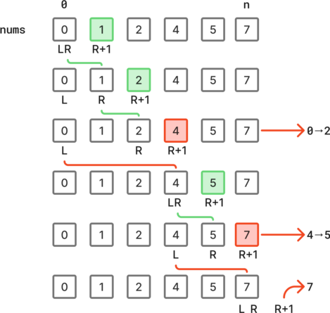
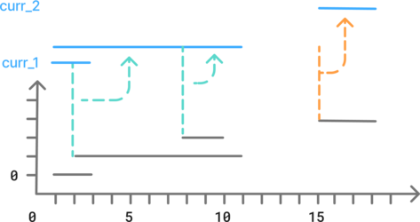
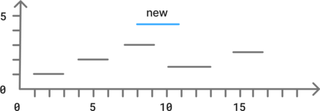

# Intervals

## 228. Summary Ranges

You are given a **sorted unique** integer array `nums`.

A **range** `[a,b]` is the set of all integers from `a` to `b` (inclusive).

Return *the **smallest sorted** list of ranges that **cover all the numbers in the array exactly***. That is, each element of `nums` is covered by exactly one of the ranges, and there is no integer `x` such that `x` is in one of the ranges but not in `nums`.

Each range `[a,b]` in the list should be output as:

- `"a->b"` if `a != b`
- `"a"` if `a == b`

 

**Example:**

- Input: `nums = [0,1,2,4,5,7]`
- Output: `["0->2","4->5","7"]`


### Approach 1: Use two pointers to discover the ranges

We can find the intervals with a left and right pointer.

- the left pointer represents the start of the interval.
- the right pointer is the current end of the interval.

The right pointer is moved as long as its right neighbor is one higher than itself.

Otherwise, we add the current interval values to the result.





```python
class Solution:
    def summaryRanges(self, nums: list[int]) -> list[str]:
        res = []
        n = len(nums)
        l = 0
        while l < n:
            r = l
            while r + 1 < n and nums[r + 1] == nums[r] + 1:
                r += 1
            res.append(f"{nums[l]}->{nums[r]}" if l != r else f"{nums[l]}")
            l = r + 1
        return res
```

Time: O(n)

Space: O(1) *- excluding the result*


## 56. Merge intervals

Given an array of `intervals` where `intervals[i] = [start_i, end_i]`, merge all overlapping intervals, and return *an array of the non-overlapping intervals that cover all the intervals in the input*.


**Example:**

- Input: `intervals = [[1,3],[2,11],[8,10],[15,18]]`
- Output: `[[1,11],[15,18]]`


### Approach 1: Sort intervals by start position, then update current intervals

Sorting the intervals by start value make is easier, because we will already know that each subsequent interval starts after.

Another good practice is to a define the current interval and to update this interval if appropriate when iterating on the subsequent intervals:

- if the next interval starts before the end of the current interval, then we can merge the intervals.
  - the start of the current interval won't change, because the next interval starts after
  - however, the end is the greatest value between the current and the next interval
- if there is no overlap, add the current interval to the result, and set the next interval as the current one.

Finally, add the last current interval to the result before returning.





```python
class Solution:
    def merge(self, intervals: list[list[int]]) -> list[list[int]]:
        n = len(intervals)
        intervals.sort()
        curr = intervals[0]

        res = []
        for i in range(1, n):
            next = intervals[i]
            if next[0] <= curr[1]:
                curr[1] = max(curr[1], next[1])
            else:
                res.append(curr)
                curr = next

        res.append(curr)
        return res
```

Time: O(n log(n))

Space: O(n)


## 57. Insert interval

You are given an array of non-overlapping intervals `intervals` where `intervals[i] = [start_i, end_i]` represent the start and the end of the `i-th` interval and `intervals` is sorted in ascending order by `start_i`. You are also given an interval `newInterval = [start, end]` that represents the start and end of another interval.

Insert `newInterval` into `intervals` such that `intervals` is still sorted in ascending order by `start_i` and `intervals` still does not have any overlapping intervals (merge overlapping intervals if necessary).

Return `intervals` *after the insertion*.

**Note** that you don't need to modify `intervals` in-place. You can make a new array and return it.


**Example:**

- Input: `intervals = [[1,3],[6,9]]`, `newInterval = [2,5]`
- Output: ` [[1,5],[6,9]]`


### Approach 1: Consecutive while loops sharing the same pointer

Since we add a single interval, we have to perform at most a single  merge operation, although this can involve multiple intervals.

The idea is to split the process in different phases:

1. Add firsts non-interfering interval.
2. Merge the interfering intervals with the new intervals and add it.
3. Add the remaining non-interfering intervals.





```python
class Solution:
    def insert(
        self, intervals: list[list[int]], newInterval: list[int]
    ) -> list[list[int]]:
        n = len(intervals)
        res = []

        i = 0
        while i < n and intervals[i][1] < newInterval[0]:
            res.append(intervals[i])
            i += 1

        merge = newInterval
        while i < n and intervals[i][0] <= merge[1]:
            merge[0] = min(merge[0], intervals[i][0])
            merge[1] = max(merge[1], intervals[i][1])
            i += 1
        res.append(merge)

        while i < n:
            res.append(intervals[i])
            i += 1

        return res
```

Time: O(n)

Space: O(n)


### Approach 2: Add the new interval, then merge all intervals

If we add the new interval to the interval list, then we can reuse the algorithm from the problem *56. Merge Intervals* to get to the result.

However, the sorting algorithm slightly increases the time complexity.

```python
class Solution:
    def insert(
        self, intervals: list[list[int]], newInterval: list[int]
    ) -> list[list[int]]:
        intervals.append(newInterval)
        intervals.sort()

        res = [intervals[0]]

        for i in range(1, len(intervals)):
            if res[-1][1] >= intervals[i][0]:
                res[-1][1] = max(res[-1][1], intervals[i][1])
            else:
                res.append(intervals[i])

        return res
```

Time: O(n log(n))

Space: O(n)
