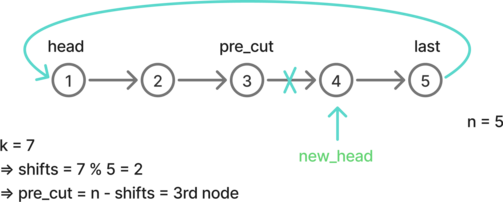

# Linked lists


## 141. Linked list cycle

Given `head`, the head of a linked list, determine if the linked list has a cycle in it.

There is a cycle in a linked list if there is some node in the list that can be reached again by continuously following the `next` pointer. Internally, `pos` is used to denote the index of the node that tail's `next` pointer is connected to. **Note that `pos` is not passed as a parameter**.

Return `true` *if there is a cycle in the linked list*. Otherwise, return `false`.

 

### Approach 1: Using slow and fast pointers

If we select any given node, we can try to find out whether there is a cycle by moving a pointer until we either reach the end of the list or come back to the selected node, but there might also be a cycle after the selected node, which will result in an infinite loop.

The infinite loop issue can be resolved by using a slow and a fast pointer. The slow pointer makes a move of one node at each iteration while the fast pointer makes a move of two. If there is any cycle in the list, both the slow and fast pointers will end up within it. At this point, the fast pointer, moving twice as fast as the slow one, will inevitably come back to the same node as the slow one. We can detect this equality to determine there is a cycle. If the fast pointers reaches the end of the list, it means that there is no cycle.

The time complexity is O(n), because it takes at most n iterations for the slow pointer to get in the cycle, and also at most n iterations for the fast pointer to join the slow pointer. 


```python
class Solution:
    def hasCycle(self, head: Optional[ListNode]) -> bool:
        if not head or not head.next:
            return False
        slow, fast = head, head.next
        while fast.next and fast.next.next:
            slow = slow.next
            fast = fast.next.next
            if fast is slow:
                return True

        return False
```

Time: O(n) - Space: O(1)


## 2. Add two numbers

You are given two **non-empty** linked lists representing two non-negative integers. The digits are stored in **reverse order**, and each of their nodes contains a single digit. Add the two numbers and return the sum as a linked list.

You may assume the two numbers do not contain any leading zero, except the number 0 itself.


**Example:**

- Input: `l1 = [2,4,3]`, ` l2 = [5,6,4]`
- Output: `[7,0,8]`


### Approach 1: Build the result by computing digit and carry iteratively

Move a pointer along the list iteratively.

As long as one of the list contains a digit:

- compute the value
- deduce the digit and carry
- add a new node to the result

If `l1` and `l2`  reached the end but the carry is not zero, we should add a final node with its value.


```python
class Solution:
    def addTwoNumbers(
        self, l1: Optional[ListNode], l2: Optional[ListNode]
    ) -> Optional[ListNode]:
        preres = ListNode(0)
        curres = preres
        carry = 0

        while l1 or l2 or carry:
            val = carry
            if l1:
                val += l1.val
                l1 = l1.next
            if l2:
                val += l2.val
                l2 = l2.next
            carry = val // 10
            digit = val % 10

            curres.next = ListNode(digit)
            curres = curres.next

        return preres.next
```

Time: O(n) - Space: O(n)


## 83. Remove duplicates from sorted list

Given the `head` of a sorted linked list, *delete all duplicates such that each element appears only once*. Return *the linked list **sorted** as well*.

**Example:**

- Input: `head = [1,1,2,2]`
- Output: `[1,2]`


### Approach 1: Modify the current list in place

As long as there are two consecutive elements that haven't been checked in the list, there might be a duplicate.

If the consecutive elements:

- have the same value, connect directly with the second one to leave out the first.
- have different values, we don't need to leave out the first element and we can just move the current pointer to the next one.

We are done when the second element reaches the end of the list.


````python
class Solution:
    def deleteDuplicates(self, head: Optional[ListNode]) -> Optional[ListNode]:
        pre_head = ListNode(0, head)

        pre_curr = pre_head
        while pre_curr.next and pre_curr.next.next:
            if pre_curr.next.val == pre_curr.next.next.val:
                pre_curr.next = pre_curr.next.next
            else:
                pre_curr = pre_curr.next

        return pre_head.next
````

Time: O(n)

Space: O(1)


### Approach 2: Modify the list in place without pre_head

Similar to the previous approach, but more concise because not `pre_head` pointer is needed.

It works because we can also decide to leave out the second element in a pair of duplicate nodes. Therefore, we don't need to reference to the node before the current one.


````python
class Solution:
    def deleteDuplicates(self, head: Optional[ListNode]) -> Optional[ListNode]:
        cur = head
        while cur and cur.next:
            if cur.val == cur.next.val:
                cur.next = cur.next.next
            else:
                cur = cur.next
        return head
````

Time: O(n)

Space: O(1)


## 61. Rotate list

Given the `head` of a linked list, rotate the list to the right by `k` places.

**Example:**

- Input: `head = [1,2,3,4,5]`, ` k = 2`
- Output: `[4,5,1,2,3]`


### Approach 1: Find list length, compute shift numbers & rearrange

If the number of shifts `k` is greater than the length of the list, we don't want the list to perform unnecessary rotations. Any number of shifts which is a multiple of the list length `n` will bring the list to the same state. Therefore, we only need to perform `k % n` shifts.

To achieve this, we first explore the list once to find its length and the last element.

Once the number of shifts is computed:

- if the value is zero, we don't need perform any modification and can return the list as it is.
- otherwise we find the node before th cut. Finally, with the references to the `head`, `pre_cut` and `last`, we can rearrange the list an return its new head.





```python
class Solution:
    def _find_last(self, head: ListNode) -> tuple[int, ListNode]:
        curr, i = head, 1
        while curr.next:
            curr = curr.next
            i += 1

        return i, curr

    def _find(self, head: ListNode, pos: int) -> ListNode:
        curr = head
        for _ in range(pos):
            curr = curr.next
        return curr

    def rotateRight(self, head: Optional[ListNode], k: int) -> Optional[ListNode]:
        if not head:
            return head

        n, last = self._find_last(head)

        shifts = k % n

        if shifts == 0:
            return head

        pre_cut = self._find(head, n - shifts - 1)

        new_head = pre_cut.next
        last.next = head
        pre_cut.next = None

        return new_head
```

Time: O(n)

Space: O(1)
