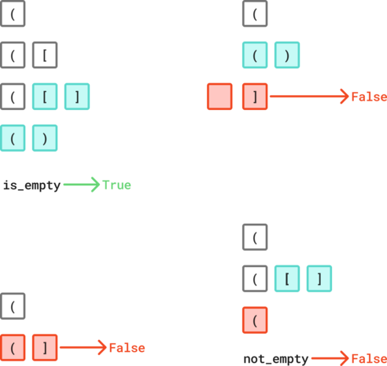
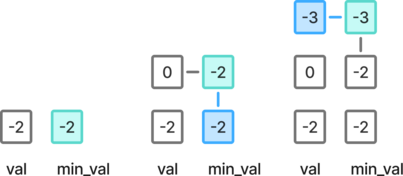
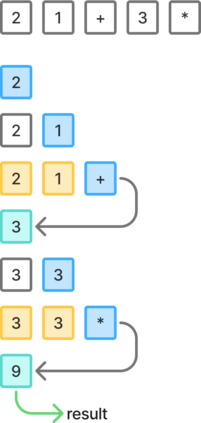
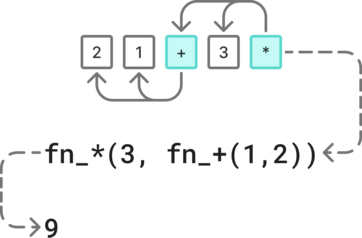
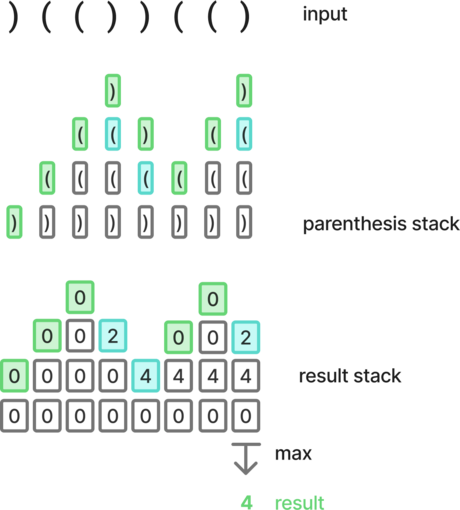
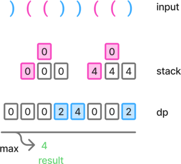
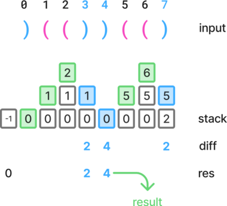
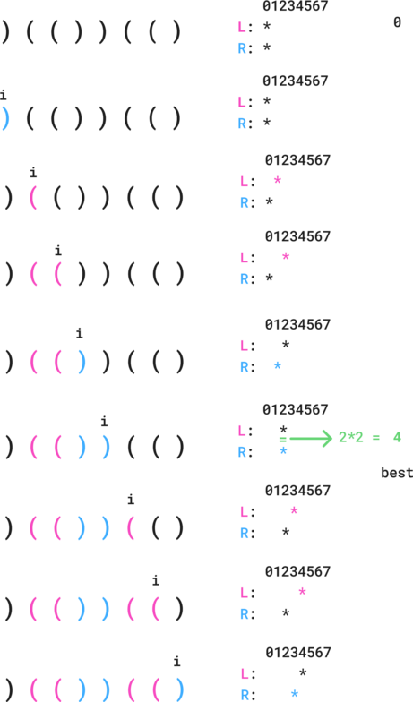

# Stack

## 20. Valid parenteses

Given a string `s` containing just the characters `'('`, `')'`, `'{'`, `'}'`, `'['` and `']'`, determine if the input string is valid.

An input string is valid if:

1. Open brackets must be closed by the same type of brackets.
2. Open brackets must be closed in the correct order.
3. Every close bracket has a corresponding open bracket of the same type.


**Example:**

- Input: `s = "([])"`

  Output: `True`


### Approach 1: Using a set and hardcoded logic

We iterate through the characters of the string:

- if the character is an open bracket, we can always add it to the stack an we will check whether we find a corresponding close bracket.

- if the character is a close bracket, we must have a corresponding open bracket on the top of the stack.
  - therefore we check first that we have at least one element in the stack
  - then we check that this element is matching the current character, while removing it from the stack.

Finally, if the stack is not empty after all characters have been processes, it means that some brackets didn't find their matching character. Therefore we can return `True` only if the stack is empty.





```python
class Solution:
    def isValid(self, s: str) -> bool:
        opening = set(["(", "[", "{"])
        stack = []
        for c in s:
            if c in opening:
                stack.append(c)
                continue

            if not stack:
                return False

            if c == ")" and stack.pop() != "(":
                return False
            if c == "]" and stack.pop() != "[":
                return False
            if c == "}" and stack.pop() != "{":
                return False

        return not stack
```

Time: O(n)

Space: O(n)


### Approach 2: Using a dictionary

We use a `match` dictionary to both:

- find whether the current character is an open or close bracket using the keys.
- whether the character at the top of the stack is matching the current close bracket.


While processing a close bracket, we make use of the lazy OR evaluation:

- if the stack is empty, we will immediately return `False`.
- otherwise there will be at least an element which we can safely pop to check its value and return `False` only if there is a mismatch.


```python
class Solution:
    def isValid(self, s: str) -> bool:
        match = {")": "(", "]": "[", "}": "{"}
        stack = []
        for c in s:
            if c in match:
                if not stack or stack.pop() != match[c]:
                    return False
            else:
                stack.append(c)

        return not stack
```

Time: O(n)

Space: O(n)


## 155. Min Stack

Design a stack that supports push, pop, top, and retrieving the minimum element in constant time.

Implement the `MinStack` class:

- `MinStack()` initializes the stack object.
- `void push(int val)` pushes the element `val` onto the stack.
- `void pop()` removes the element on the top of the stack.
- `int top()` gets the top element of the stack.
- `int getMin()` retrieves the minimum element in the stack.

You must implement a solution with `O(1)` time complexity for each function.


**Example:**

```python
obj = MinStack()
obj.push(-2)
obj.push(0)
obj.push(-3)
print(obj.getMin()) # -> -3
obj.pop()
print(obj.top())    # -> 0
print(obj.getMin()) # -> -2
```


### Approach 1: Store both the values and min values in a stack.

If we use a stack to store not only the values, but also the corresponding minimum value. Then by pushing a new value to the stack, we can define the new minimum by taking the lowest value between the new value and the current minimum (on the top of the stack), which is a constant time computation. 

The new minimum can be pushed to the stack and reused for later pushes.





```python
class MinStack:
    def __init__(self):
        self.stack = []

    def push(self, val: int) -> None:
        min_val = min(val, self.stack[-1][1]) if self.stack else val
        self.stack.append((val, min_val))

    def pop(self) -> None:
        self.stack.pop()

    def top(self) -> int:
        return self.stack[-1][0]

    def getMin(self) -> int:
        return self.stack[-1][1]
```

Time: O(1) *- for each operation*

Space: O(1)


## 150. Evaluate reverse polish notation

You are given an array of strings `tokens` that represents an arithmetic expression in a [Reverse Polish Notation](http://en.wikipedia.org/wiki/Reverse_Polish_notation).

Evaluate the expression. Return *an integer that represents the value of the expression*.

**Note** that:

- The valid operators are `'+'`, `'-'`, `'*'`, and `'/'`.
- Each operand may be an integer or another expression.
- The division between two integers always **truncates toward zero**.
- There will not be any division by zero.
- The input represents a valid arithmetic expression in a reverse polish notation.
- The answer and all the intermediate calculations can be represented in a **32-bit** integer.


**Example:**

- Input: `tokens = ["2","1","+","3","*"]`
- Output: `9`


### Approach 1: Using a stack bottom up

We can iterate on the tokens and add the numbers to a stack. When we find an operation token,  the two last values can be used to perform the operation and place the intermediary result back on the stack.

If the given tokens represent a valid expression, there will be a single value left in the stack at the end, which we can return as the result.





```python
class SolutionStack:
    def evalRPN(self, tokens: list[str]) -> int:
        operations = {
            "+": lambda x, y: x + y,
            "-": lambda x, y: x - y,
            "*": lambda x, y: x * y,
            "/": lambda x, y: int(x / y),
        }
        stack = []
        for t in tokens:
            if t in operations:
                b = int(stack.pop())
                a = int(stack.pop())
                stack.append(operations[t](a, b))
            else:
                stack.append(t)

        return int(stack[0])
```

Time: O(n)

Space: O(n)


### Approach 2: Using recursivity top down

We can also handle the given tokens as a stack and evaluate the expression top down using recursivity.

Each token is removed from the stack starting from the right side while the expression is being converted into recursive functions. The top level call directly returns the result.





```python
class Solution:
    operators = {
        "+": lambda x, y: x + y,
        "-": lambda x, y: x - y,
        "*": lambda x, y: x * y,
        "/": lambda x, y: int(x / y),
    }

    def evalRPN(self, tokens: list[str]) -> int:
        token = tokens.pop()

        if token in self.operators:
            fn = self.operators[token]
            b = self.evalRPN(tokens)
            a = self.evalRPN(tokens)
            return fn(a, b)
        else:
            return int(token)
```

Time: O(n)

Space: O(n)


## 32. Longest valid parentheses

Given a string containing just the characters `'('` and `')'`, return *the length of the longest valid (well-formed) parentheses* substring.


**Example:**

- Input: `s = ")()())"`
- Output: `4`


### Approach 1: Using a double stack

The issue being that if we have an opening parenthesis, we know whether we can add it (and everything it contains) to the current valid sequence only if what it contains is valid and it ends up being closed. Which means that we want to temporarily count the length of a separate sequence, and only merge the sequences lengths if appropriate later on.

To achieve this, the idea is to use one stack to find pairs of parentheses, and another one to keep track of the counts. The value of the top of the result stack represents the length of the current valid sequence.

While iterating on the string characters:

- if we don't have a pair of parentheses, we add the value `0` on top of the result stack.
- if we have a pair of pair of parentheses, we:
  - take into account the valid sequence length within the parenthesis &rarr; pop the top value from the result stack add it to the new top.
  - add the open and close parenthesis to the valid sequence length &rarr; add two to the new top of the result stack.
  - both of these values are added to the length of the valid sequence preceeding the current sequence.

If there is an invalid sequence, it only add more zeroes in the stack, making it impossible for the surrounding sequence lengths to merge.

At the end, we can return the maximum of the valid sequence lengths.





```python
class Solution:
    def longestValidParentheses(self, s: str) -> int:
        res = [0]
        stack = []
        for c in s:
            if c == ")" and stack and stack[-1] == "(":
                stack.pop()
                v = res.pop() + 2
                res[-1] += v
            else:
                stack.append(c)
                res.append(0)

        return max(res)
```

Time: O(n)

Space: O(n)


### Approach 2: Using a stack and an array





```python
class Solution:
    def longestValidParentheses(self, s: str) -> int:
        dp = [0] * len(s)
        stack = []

        for i in range(len(s)):
            if s[i] == "(":
                stack.append(dp[i - 1])
            elif len(stack):
                dp[i] = stack.pop() + 2 + dp[i - 1]

        return max(dp, default=0)
```

Time: O(n)

Space: O(n)


### Approach 3: Using a stack of indexes





```python
class Solution:
    def longestValidParentheses(self, s: str) -> int:
        stack = [-1]
        res = 0

        for i in range(len(s)):
            if s[i] == "(":
                stack.append(i)
            else:
                stack.pop()
                if len(stack) == 0:
                    stack.append(i)
                else:
                    res = max(res, i - stack[-1])

        return res
```

Time: O(n)

Space: O(n)


### Approach 4: Using two pointers

The idea here is use two pointers to explore the valid sequences and save the longest value.

To do this, we count the left and right parentheses of the current sequence:

- if `r > l`, it means that we have too many closing parenthesis, and we should `l` and `r` to search for a new sequence.
- if `l == r`, it means that the current sequence is complete, and we should consider the sequence length as a candidate.

However, there is the issue that we cannot find a valid sequence if it starts with an opening parenthesis which ends up being invalid. For example, we end the sequence `(()()(` with `l=4` and `r=2`, without the counts ever matching.

This issue can be addressed with a second pass, searching from the right side. It will be equivalent as reversing the string. For example we will get the sequence `)()())` and after the first closing parenthesis is ignored, we get `l=2` and `r=2`.





```python
class Solution:
    def longestValidParentheses(self, s: str) -> int:
        res = 0

        l, r = 0, 0
        for i in range(len(s)):
            if s[i] == "(":
                l += 1
            else:
                r += 1

            if l == r:
                res = max(res, 2 * l)
            elif l < r:
                l, r = 0, 0

        l, r = 0, 0
        for i in range(len(s) - 1, -1, -1):
            if s[i] == ")":
                r += 1
            else:
                l += 1

            if l == r:
                res = max(res, 2 * l)
            elif l > r:
                l, r = 0, 0

        return res
```

Time: O(n)

Space: O(1)
